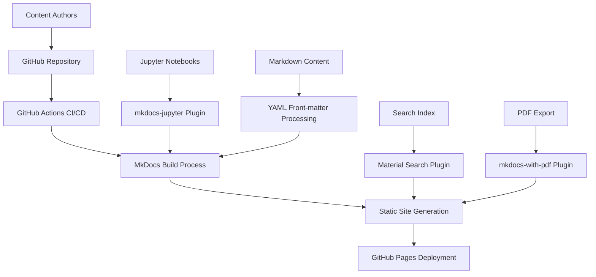

# Design Document: AI-Powered Instructional Design Ebook

## Overview

The AI-Powered Instructional Design ebook will be built as a modern, open-source digital publication using MkDocs Material as the static site generator. The system will transform markdown content and Jupyter notebooks into a professional, searchable, and accessible ebook hosted on GitHub Pages. The design emphasizes collaborative development, academic rigor, and practical application of AI in educational contexts.

## Architecture

### High-Level Architecture



### Technology Stack

- **Static Site Generator**: MkDocs with Material theme
- **Content Format**: Markdown with YAML front-matter, Jupyter notebooks (.ipynb)
- **Hosting**: GitHub Pages
- **CI/CD**: GitHub Actions
- **Version Control**: Git/GitHub
- **Search**: Material theme built-in search with lunr.js
- **PDF Generation**: mkdocs-with-pdf plugin

## Components and Interfaces

### Core Components

#### 1. Content Management System
- **Purpose**: Organize and structure ebook content with metadata
- **Implementation**: File-based system using markdown and YAML front-matter
- **Key Features**:
  - YAML front-matter for metadata (tags, difficulty, last_reviewed, reading_time)
  - Hierarchical content organization
  - Cross-reference management
  - Citation tracking

#### 2. Static Site Generator (MkDocs Material)
- **Purpose**: Transform source content into deployable website
- **Configuration**: `mkdocs.yml` with Material theme and plugins
- **Key Features**:
  - Responsive design with light/dark mode
  - Navigation generation
  - Search functionality
  - Accessibility compliance

#### 3. Jupyter Integration Layer
- **Purpose**: Render Jupyter notebooks as native content
- **Implementation**: mkdocs-jupyter plugin
- **Key Features**:
  - Preserve code cells and outputs
  - Generate "Open in Colab" badges
  - Maintain notebook metadata

#### 4. CI/CD Pipeline
- **Purpose**: Automate build, test, and deployment processes
- **Implementation**: GitHub Actions workflows
- **Key Features**:
  - Automated link checking
  - Content validation
  - Multi-format generation
  - Deployment to GitHub Pages

#### 5. Search System
- **Purpose**: Enable full-text search across all content
- **Implementation**: Material theme search with lunr.js indexing
- **Key Features**:
  - Real-time search suggestions
  - Content highlighting
  - Index optimization

### Interface Specifications

#### Content Structure Interface
```yaml
# YAML Front-matter Schema
title: string
description: string
tags: [string]
difficulty: "Beginner" | "Intermediate" | "Advanced"
last_reviewed: date (YYYY-MM-DD)
reading_time: integer (minutes)
authors: [string]
```

#### MkDocs Configuration Interface
```yaml
# mkdocs.yml structure
site_name: string
theme:
  name: material
  features: [string]
  palette: object
plugins:
  - search
  - mkdocs-jupyter
  - with-pdf
nav: object
```

## Data Models

### Content Page Model
```python
class ContentPage:
    title: str
    description: str
    content: str  # Markdown content
    metadata: dict  # YAML front-matter
    last_modified: datetime
    file_path: str
    tags: List[str]
    difficulty: str
    reading_time: int
```

### Jupyter Notebook Model
```python
class NotebookPage:
    title: str
    cells: List[Cell]
    metadata: dict
    colab_url: str
    file_path: str
    
class Cell:
    cell_type: str  # "code" | "markdown"
    source: str
    outputs: List[dict]  # For code cells
```

### Citation Model
```python
class Citation:
    id: str
    authors: List[str]
    title: str
    publication: str
    year: int
    url: str
    apa_format: str
```

### Search Index Model
```python
class SearchDocument:
    title: str
    content: str
    url: str
    tags: List[str]
    section: str
    boost: float  # Search ranking boost
```
## Correctness Properties

*A property is a characteristic or behavior that should hold true across all valid executions of a system—essentially, a formal statement about what the system should do. Properties serve as the bridge between human-readable specifications and machine-verifiable correctness guarantees.*

### Property 1: Content Organization Consistency
*For any* content with YAML front-matter metadata, the Static Site Generator should correctly process and organize the content according to the metadata, maintaining consistent structure and generating appropriate navigation hierarchies.
**Validates: Requirements 1.1, 1.2, 1.4, 1.5**

### Property 2: Link Integrity Preservation  
*For any* content update or structural change, all existing internal cross-references and links should remain functional and correctly resolve to their intended targets.
**Validates: Requirements 1.3, 2.3, 7.1, 7.3**

### Property 3: Citation Format Compliance
*For any* citation in the content, it should conform to APA 7th Edition format, and all citations should be automatically collected into a comprehensive bibliography page.
**Validates: Requirements 3.3, 3.4**

### Property 4: Theme Persistence and Accessibility
*For any* user session, theme preferences (light/dark mode) should persist across browser sessions, and all generated HTML should use semantic HTML5 tags for accessibility compliance.
**Validates: Requirements 4.1, 4.2, 4.5**

### Property 5: Responsive Design Adaptation
*For any* viewport size, the Static Site Generator should render content with appropriate responsive layout adaptations while maintaining readability and functionality.
**Validates: Requirements 4.4**

### Property 6: Admonition Block Rendering
*For any* content containing admonition blocks (Note, Warning, Tip), they should render with appropriate visual styling to distinguish different types of information.
**Validates: Requirements 4.3**

### Property 7: Jupyter Notebook Integration
*For any* Jupyter notebook file, the Static Site Generator should preserve code cells, outputs, and visualizations while generating appropriate "Open in Colab" badges for executable content.
**Validates: Requirements 5.1, 5.2, 5.4**

### Property 8: Resource Availability
*For any* framework or template referenced in the content, the associated downloadable files should be accessible and properly linked.
**Validates: Requirements 5.3**

### Property 9: Contributor Recognition
*For any* contribution to the project, contributor information should be tracked and maintained in an accessible contributors list.
**Validates: Requirements 6.5**

### Property 10: Content Freshness Tracking
*For any* content page with a last_reviewed date in YAML front-matter, pages older than 6 months should be visually flagged as potentially outdated.
**Validates: Requirements 7.2**

### Property 11: Content Integration Seamlessness
*For any* new chapter or content addition, it should integrate seamlessly into the existing navigation structure and content organization.
**Validates: Requirements 7.4**

### Property 12: Search Functionality Completeness
*For any* search query, the search function should provide real-time suggestions, highlight matching terms in results, display context snippets, and index all content including titles, headings, and body text.
**Validates: Requirements 8.1, 8.2, 8.3, 8.4, 8.5**

### Property 13: License Display Consistency
*For any* generated page, the Creative Commons license (CC-BY-4.0) should be displayed in the footer.
**Validates: Requirements 9.1**

## Error Handling

### Content Processing Errors
- **Invalid YAML Front-matter**: System should provide clear error messages for malformed YAML and continue processing other content
- **Broken Internal Links**: Link checker should identify and report broken references with specific file and line information
- **Missing Citations**: System should flag incomplete or malformed citations and provide formatting guidance
- **Notebook Processing Failures**: Failed notebook rendering should not break the entire build; fallback to source display

### Build Process Errors
- **Plugin Failures**: Individual plugin failures should be isolated and not crash the entire build process
- **Theme Asset Missing**: Missing theme assets should fallback to default styling rather than breaking the site
- **Search Index Corruption**: Search functionality should gracefully degrade if index building fails
- **PDF Generation Errors**: PDF export failures should not prevent HTML site generation

### Deployment Errors
- **GitHub Pages Limits**: System should validate content size and structure against GitHub Pages limitations
- **Asset Path Issues**: Relative path resolution should be validated during build to prevent broken assets
- **Cache Invalidation**: Deployment should include proper cache busting for updated assets

## Testing Strategy

### Dual Testing Approach
The testing strategy employs both unit tests and property-based tests to ensure comprehensive coverage:

**Unit Tests** focus on:
- Specific examples of content processing (markdown parsing, YAML front-matter extraction)
- Integration points between MkDocs plugins
- Edge cases in citation formatting and bibliography generation
- Error conditions and graceful degradation scenarios
- Specific file presence validation (LICENSE, CODE_OF_CONDUCT.md, CONTRIBUTING.md)

**Property-Based Tests** focus on:
- Universal properties that hold across all content inputs
- Content organization and navigation generation across various structures
- Link integrity preservation across different update scenarios
- Search functionality across diverse content types
- Theme and accessibility compliance across all generated pages

### Property-Based Testing Configuration
- **Testing Framework**: Hypothesis (Python) for property-based testing
- **Minimum Iterations**: 100 iterations per property test
- **Test Tagging**: Each property test references its design document property using the format:
  - **Feature: ai-instructional-design-ebook, Property {number}: {property_text}**

### Testing Tools and Frameworks
- **Unit Testing**: pytest for Python-based testing
- **Property Testing**: Hypothesis for generating test cases
- **Link Checking**: pytest-html-link-checker for automated link validation
- **Accessibility Testing**: axe-core integration for accessibility compliance
- **Performance Testing**: Lighthouse CI for performance regression detection
- **Content Validation**: Custom validators for citation format and YAML schema compliance

### Continuous Integration Testing
- **Pre-commit Hooks**: Link checking, citation format validation, YAML schema validation
- **Pull Request Validation**: Full test suite execution, accessibility scanning, performance benchmarking
- **Deployment Testing**: Post-deployment smoke tests to verify site functionality
- **Scheduled Testing**: Weekly full regression testing to catch external dependency changes