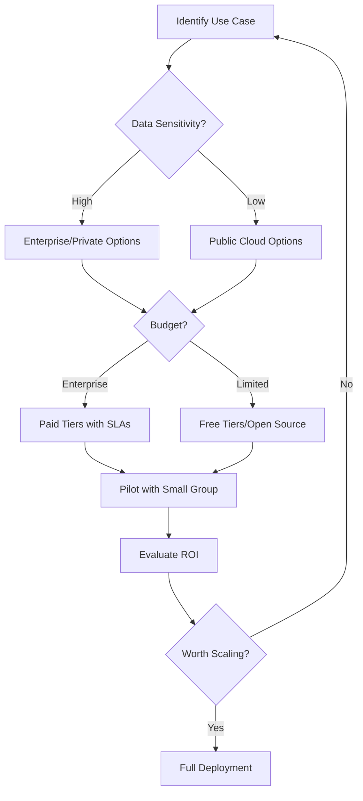

# AI Tools Reference Guide

A practical reference for instructional designers exploring AI tools. This guide is organized by **use case** to help you find the right tool for your specific needs.

!!! warning "Tools Evolve Rapidly"
    The AI tool landscape changes constantly. This guide focuses on **categories** and **evaluation criteria** rather than exhaustive listings. Always verify current pricing, features, and terms of service before adopting any tool.

---

## 📝 Content Generation & Writing

### Large Language Models (LLMs)

| Tool | Best For | Key Considerations |
|------|----------|-------------------|
| **ChatGPT (OpenAI)** | General content generation, brainstorming | Most widely adopted; data may train models |
| **Claude (Anthropic)** | Long-form content, nuanced writing | Strong safety focus; excellent for complex reasoning |
| **Gemini (Google)** | Research, multimodal tasks | Integrated with Google Workspace |
| **Copilot (Microsoft)** | Enterprise integration | Works within Microsoft 365 ecosystem |

### Specialized Writing Tools

| Tool | Best For | Key Considerations |
|------|----------|-------------------|
| **Jasper** | Marketing-style training content | Templates for various content types |
| **Copy.ai** | Short-form content, emails | Good for quick drafts |
| **Writesonic** | SEO-optimized content | Includes AI image generation |
| **Grammarly** | Editing and tone adjustment | Real-time writing assistance |

---

## 🎬 Video & Avatar Generation

### AI Video Platforms

| Tool | Best For | Key Considerations |
|------|----------|-------------------|
| **Synthesia** | Professional training videos with AI avatars | Enterprise-ready; custom avatar options |
| **HeyGen** | Quick video creation | Personal avatar training available |
| **Colossyan** | Scenario-based training videos | Branching video support |
| **D-ID** | Animated talking photos | Good for personalization at scale |
| **Pictory** | Converting scripts to video | Strong for text-to-video workflows |

### Video Editing with AI

| Tool | Best For | Key Considerations |
|------|----------|-------------------|
| **Descript** | Podcast/video editing via transcript | Edit by editing text |
| **Runway** | AI-powered video effects | Advanced generative capabilities |
| **CapCut** | Quick social-style videos | Free tier available |
| **InVideo** | Template-based video creation | Good for consistent branding |

---

## 🎙️ Audio & Voice Generation

### Text-to-Speech (TTS)

| Tool | Best For | Key Considerations |
|------|----------|-------------------|
| **ElevenLabs** | Ultra-realistic voices | Voice cloning capabilities |
| **WellSaid Labs** | Enterprise voiceovers | Brand voice consistency |
| **Murf.ai** | Multi-language voiceovers | 120+ voices, 20+ languages |
| **Play.ht** | Podcast and audio content | Customizable pronunciation |
| **LOVO** | Emotional voice generation | Good for scenario-based training |

### Audio Tools

| Tool | Best For | Key Considerations |
|------|----------|-------------------|
| **Otter.ai** | Meeting transcription | Real-time transcription |
| **Whisper (OpenAI)** | Accurate transcription | Open-source, self-hostable |
| **Adobe Podcast** | Audio enhancement | Removes background noise |

---

## 🎨 Image & Visual Generation

### AI Image Generators

| Tool | Best For | Key Considerations |
|------|----------|-------------------|
| **Midjourney** | High-quality artistic images | Discord-based interface |
| **DALL-E 3** | Integrated with ChatGPT | Strong text adherence |
| **Stable Diffusion** | Open-source, self-hosted | Privacy-conscious organizations |
| **Adobe Firefly** | Commercial-safe images | Trained on licensed content |
| **Ideogram** | Text in images | Good for infographics with captions |

### Design & Presentation

| Tool | Best For | Key Considerations |
|------|----------|-------------------|
| **Canva (Magic Studio)** | Quick visual design | AI features in familiar tool |
| **Tome** | AI-generated presentations | Great for rapid prototyping |
| **Beautiful.ai** | Professional slide design | Smart formatting |
| **Gamma** | Documents and decks | Clean, modern templates |

---

## 🔍 Research & Knowledge Management

### Research Assistants

| Tool | Best For | Key Considerations |
|------|----------|-------------------|
| **Perplexity** | Research with citations | Shows sources |
| **Elicit** | Academic paper research | Focused on peer-reviewed content |
| **Consensus** | Scientific consensus finding | Great for evidence-based claims |
| **Semantic Scholar** | Academic literature search | AI-powered paper recommendations |

### Knowledge Base & RAG

| Tool | Best For | Key Considerations |
|------|----------|-------------------|
| **NotebookLM (Google)** | Document analysis | Upload your own docs |
| **ChatPDF** | Querying PDF documents | Simple interface |
| **Notion AI** | Knowledge base with AI | Integrated workspace |
| **Obsidian + plugins** | Personal knowledge management | Local-first, plugin ecosystem |

---

## 📊 Assessment & Analytics

### Quiz & Assessment Generation

| Tool | Best For | Key Considerations |
|------|----------|-------------------|
| **Quizgecko** | Auto-generate quizzes from content | Multiple question types |
| **ClassMarker** | Professional assessments | Detailed analytics |
| **Quillionz** | Question generation from text | Bloom's taxonomy alignment |

### Learning Analytics

| Tool | Best For | Key Considerations |
|------|----------|-------------------|
| **Watershed LRS** | xAPI learning record store | Enterprise analytics |
| **Learning Locker** | Open-source LRS | Self-hosted option |
| **Yet Analytics** | xAPI analytics | Compliance focused |

---

## 🤖 AI Agents & Automation

### No-Code AI Agents

| Tool | Best For | Key Considerations |
|------|----------|-------------------|
| **CustomGPT** | Custom chatbots from your content | No-code setup |
| **Botpress** | Conversational AI | Open-source core |
| **Voiceflow** | Voice and chat assistants | Visual builder |
| **Zapier + GPT** | Workflow automation | Connects 5000+ apps |

### Developer-Focused

| Tool | Best For | Key Considerations |
|------|----------|-------------------|
| **LangChain** | Building LLM applications | Python/JS frameworks |
| **LlamaIndex** | RAG applications | Data ingestion focus |
| **OpenAI API** | Custom AI integrations | Pay-per-use |

---

## 🔒 Enterprise & Privacy-Focused Options

For organizations with strict data privacy requirements:

| Tool | Privacy Feature |
|------|-----------------|
| **Azure OpenAI** | Data stays in your Azure tenant |
| **AWS Bedrock** | Enterprise AI with compliance certifications |
| **Anthropic Claude (Enterprise)** | No training on your data |
| **Private LLMs (Ollama, LM Studio)** | Run models locally |

---

## 🎯 Tool Selection Framework

Before adopting any AI tool, evaluate using this framework:

### Evaluation Checklist

- [ ] **Privacy**: Does the tool train on my data?
- [ ] **Security**: SOC 2, GDPR, HIPAA compliance?
- [ ] **Export**: Can I get my content out easily?
- [ ] **Integration**: Works with my LMS/authoring tools?
- [ ] **Accessibility**: Outputs meet WCAG standards?
- [ ] **Cost**: Predictable pricing model?
- [ ] **Support**: Adequate documentation and help?

---

## 🔗 Staying Current

The AI landscape changes weekly. Here are reliable sources for updates:

- **[The Rundown AI](https://www.therundown.ai/)** - Daily AI news digest
- **[There's an AI for That](https://theresanai.com/)** - AI tool directory
- **[Ben's Bites](https://bensbites.beehiiv.com/)** - Curated AI newsletter
- **[The eLearning Coach](https://theelearningcoach.com/)** - ID-specific AI coverage
- **[ATD (Association for Talent Development)](https://www.td.org/)** - Professional L&D perspective

---

*Last updated: December 2025*

!!! tip "Contribute"
    Know a great tool that should be on this list? This is an open-source project—contributions are welcome!
