# The Dawn of AI-Powered Instructional Design

The field of instructional design (ID) is experiencing its most profound transformation since the dawn of the World Wide Web. As we move into 2025, Artificial Intelligence is no longer just a "futuristic concept"—it is a **critical partner** in the design, development, and delivery of learning experiences.

!!! quote "A New Era"
    "We are not competing against AI. We are competing against other professionals who know how to use AI."
    
    — Adapted from industry consensus

---

## From Automation to Augmentation

For years, the conversation around AI in ID was dominated by **fear of replacement**. However, as noted in the *2024 EDUCAUSE Horizon Report*, generative AI (GenAI) is acting more as a **catalyst** for evolving teaching practices rather than a substitute for human ingenuity.

We are moving from:

| Old Mindset | New Mindset |
|-------------|-------------|
| AI as a threat | AI as a partner |
| Protecting our work from AI | Leveraging AI to do more |
| Fearing obsolescence | Embracing evolution |
| "AI will take my job" | "AI will change my job" |

This ebook explores the philosophy of **Co-Intelligence**, a concept coined by Ethan Mollick (2024), where instructional designers and AI collaborate in a truly symbiotic partnership.

---

## The AI-Powered ID Persona

What does it mean to be an AI-Powered Instructional Designer? It means embracing three core roles:

```mermaid
flowchart TD
    A[🧠 AI-Powered ID] --> B[🎯 Orchestrator]
    A --> C[🏛️ Architect]
    A --> D[⚖️ Guardian]
    
    B --> B1[Manages AI workflows<br>Curates outputs]
    C --> C1[Designs learning systems<br>Creates personalized paths]
    D --> D1[Ensures ethics<br>Validates accuracy]
```

### 1. 🎯 Orchestrator of Workflows

**You orchestrate AI to handle cognitive load:**
- Curating research from multiple sources
- Generating first drafts for rapid iteration
- Analyzing data at scale

This frees you to focus on **high-level strategy** and **learner empathy**—the parts that require human judgment.

### 2. 🏛️ Architect of Engagement

**You design learning systems, not just content:**
- Hyper-personalized learning paths that adapt in real-time
- AI tutors that guide without giving away answers
- Knowledge systems that learn from every interaction

The ID becomes less of a "builder who lays every brick" and more of an **architect who designs the blueprint**.

### 3. ⚖️ Guardian of Ethics

**You serve as the "Human-in-the-Loop":**
- Critically evaluating AI outputs for bias
- Verifying accuracy before deployment
- Ensuring accessibility and inclusivity
- Maintaining pedagogical soundness

AI can generate content quickly, but only humans can ensure it's **appropriate, accurate, and aligned** with learning objectives.

---

## What to Expect in This Ebook

This is not just a book about theory. It is a **technical foundation** and a **practical guide**.

### The Journey Ahead

### What You'll Find

| Section | Content Type | Purpose |
|---------|--------------|---------|
| **Foundational Concepts** | Technical explanations | Understand how AI works |
| **Prompt Frameworks** | Templates & examples | Practical tools to use immediately |
| **Mermaid Diagrams** | Visual workflows | Conceptual understanding |
| **Case Studies** | Real-world examples | Learn from others' successes & failures |
| **Reflection Exercises** | Hands-on activities | Apply concepts to your context |
| **Practical Prompts** | Ready-to-use templates | Copy, customize, and deploy |

---

## Who Is This Book For?

This ebook serves multiple audiences:

??? question "Instructional Designers"
    - New to AI and want a practical starting point
    - Already experimenting and want to go deeper
    - Looking for frameworks to elevate their practice

??? question "L&D Professionals"
    - Managing teams adopting AI
    - Building business cases for AI investment
    - Developing AI governance policies

??? question "Training Managers"
    - Leading workforce development programs
    - Implementing compliance training at scale
    - Measuring ROI of AI-enhanced learning

??? question "Educators"
    - Teaching in higher education or K-12
    - Exploring AI tutoring and personalization
    - Navigating academic integrity in the AI era

---

## How to Use This Book

### Linear Reading
Start from Chapter 1 and proceed sequentially for the complete learning journey.

### Quick Start
Short on time? Jump to the **[Quick Start Guide](../quick-start.md)** for a 15-minute overview.

### Reference
Use the **[Glossary](../glossary.md)** and **[Appendices](../appendix.md)** when you need quick answers.

### Hands-On Practice
Each chapter ends with a **Reflection Exercise**. These are designed to be immediately applicable to your current work.

---

## Key Principles

Throughout this ebook, we adhere to three guiding principles:

### 1. 🧠 AI as Partner, Not Replacement

AI extends your capabilities; it doesn't replace your expertise. The goal is **amplification**, not substitution.

### 2. ✅ Human-in-the-Loop (Always)

No AI output goes to learners without human review. Speed without quality is dangerous.

### 3. ⚖️ Ethical First

Every approach considers bias, privacy, accessibility, and accuracy. Technology serves humans, not the reverse.

---

## Key Takeaways from the Introduction

!!! success "Remember These"
    
    - AI is an **enhancement tool**, not a replacement for ID expertise
    - The shift is toward **personalized, scalable, and efficient** design
    - Human **empathy and ethical judgment** remain the core of valid instructional design
    - You are evolving from content creator to **Learning Architect**
    - The future belongs to IDs who learn to **orchestrate AI effectively**

---

## Let's Begin

Welcome to the future of learning. **Let's build it together.**

---

### What's Next?

In the next chapter, we dive into the technical engine of this transformation: **AI Fundamentals**. We'll explore how LLMs work and the core concepts every instructional designer needs to master before building their first AI-powered module.

    <a href="../quick-start/" class="md-button" style="margin-right: 1rem;">
        ⚡ Quick Start (15 min)
    </a>
    <a href="01-ai-fundamentals/" class="md-button md-button--primary">
        📖 Chapter 1: AI Fundamentals →
    </a>

