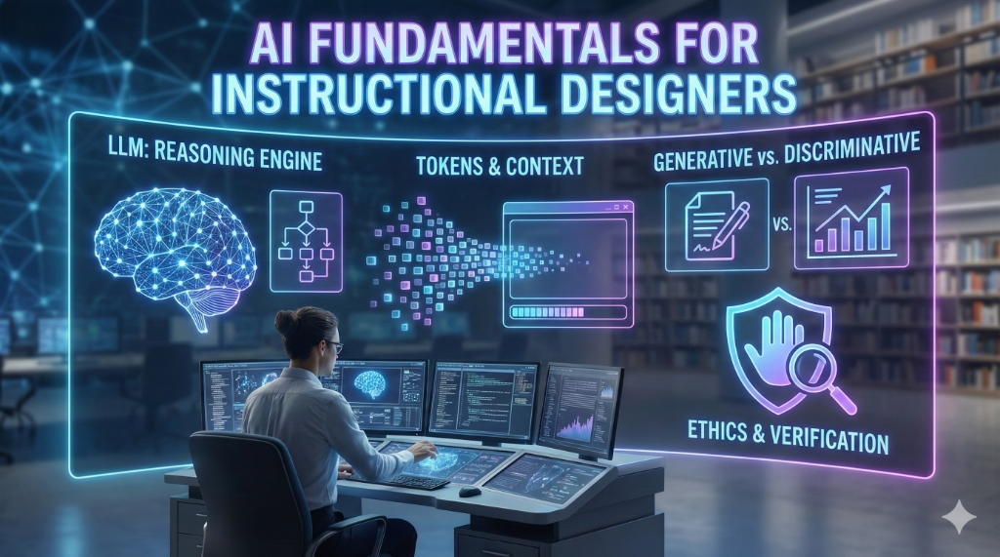

# AI Fundamentals for Instructional Designers

To design effective learning experiences with AI, we must first understand the "engine" that powers our tools. This chapter demystifies Large Language Models (LLMs) and explains the core concepts that every instructional designer should know.

## 1. What is an LLM?

A Large Language Model is a type of artificial intelligence trained on massive amounts of text data. It uses statistical patterns to predict the next word (or "token") in a sequence. 

> [!NOTE]
> Think of an LLM as a highly sophisticated "auto-complete" built on the sum of human digital knowledge.

For an ID, an LLM is more than a chatbot; it is a **reasoning engine**. It can synthesize information, take on personas (e.g., "Act as a subject matter expert in physics"), and format content into specific structures (e.g., "Generate a SCORM-compliant outline").

### The Evolution: ID to Learning Architect
As AI commoditizes content production (writing, coding, image generation), the Instructional Designer's role is shifting. We are moving from being "builders" who lay every brick to **Learning Architects**.

*   **Old Role:** Spending 80% of time drafting text, recording audio, and building slides.
*   **New Role:** Designing the blueprints (learning objectives, data flows, constraints), selecting the right AI agents to execute the build, and rigorously quality-assuring the output. The value you bring is no longer in the *creation*, but in the *curation* and *strategy*.

## 2. Tokens and Context Windows

Understanding how AI "reads" and "remembers" is crucial for prompt engineering.

### Tokens
AI doesn't read words like humans do. It breaks text into **tokens**—small chunks of characters. 
- **Rule of Thumb**: 1,000 tokens ≈ 750 words. 
- **Visual**: A standard page of single-spaced text is about 500 words, or ~660 tokens.

*Why does this matter?* API costs and model limits are often based on token counts.

### Context Window
The **context window** is the amount of information the model can "hold in its head" at once during a conversation. In 2025, context windows have expanded significantly (with some models handling millions of tokens), but the core principle remains: the more relevant context you provide in your prompt, the better the output.

## 3. Structuring Knowledge: Chaining vs. RAG

Two advanced techniques are essential for creating consistent, high-quality curriculum with AI:

*   **Prompt Chaining**: Breaking a complex task into a sequence of smaller, dependent prompts.
    *   *Use Case*: Generating a course outline (Prompt A), then using that outline to draft Module 1 (Prompt B), then creating a quiz for Module 1 (Prompt C). This maintains context and logical flow.
*   **Retrieval-Augmented Generation (RAG)**: Connecting the LLM to an external "brain" or trusted knowledge base (like your company's PDF manuals or policy documents).
    *   *Use Case*: "Answer this learner's question using *only* our 2025 Compliance Handbook." This drastically reduces hallucinations by grounding the AI in your specific facts.

## 4. Generative vs. Discriminative AI

- **Generative AI**: Creates new content (text, images, video) based on patterns. This is where most ID work happens (e.g., creating case studies).
- **Discriminative AI**: Classifies or analyzes existing data. In ID, this is used for grading, identifying gaps in a curriculum, or sentiment analysis of learner feedback.

## 5. The AI Toolbox: Beyond ChatGPT

While ChatGPT (and other LLMs like Claude or Gemini) are the most famous tools, the AI landscape for instructional designers is vast. As recent reviews by *The eLearning Coach* and *Cathy Moore* highlight, the toolkit can be categorized by function:

- **Writing & Content**: **Jasper**, **ChatGPT**, **Claude** (for brainstorming, drafting scenarios, and rewriting content).
- **Multimedia Generation**:
    - *Video*: **Synthesia** (AI avatars), **HeyGen**.
    - *Audio*: **WellSaid Labs** (high-fidelity voiceovers), **Descript** (audio/video editing with text).
    - *Presentation*: **Tome** (rapid slide generation).
- **Research & Synthesis**: **Elicit**, **Consensus** (finding academic papers and summarizing research without hallucinations).
- **Productivity**: **Otter.ai** (meeting transcription), **Notion AI**.

> [!TIP]
> Tools evolve rapidly. Focus on the *category* of the tool (e.g., "AI Voice Generator") rather than becoming dependent on a single brand.

## 6. Evaluating AI Tools: A Framework for IDs

With hundreds of new AI tools launching every week, how do you choose the right one? Use this simple checklist before adopting a new tool in your workflow:

| Criteria                     | Key Question                                                                                                                                         |
| :--------------------------- | :--------------------------------------------------------------------------------------------------------------------------------------------------- |
| **Privacy & Security**       | Does this tool use my data to train its public models? (If yes, do NOT use for proprietary content).                                                 |
| **Accuracy (Hallucination)** | How does the tool cite its sources? Can I verify the output easily?                                                                                  |
| **Cost vs. ROI**             | Does the time saved by this tool justify the subscription cost? (e.g., A $30/mo video generator is worth it if it saves 10 hours of animation work). |
| **Exportability**            | Can I easily export the content to my LMS or authoring tool (e.g., SCORM, HTML5, MP4)?                                                               |
| **Accessibility**            | Does the output meet WCAG standards (e.g., auto-captions for video)?                                                                                 |

> [!TIP]
> **Start Small:** Don't try to overhaul your entire process at once. Pick *one* tool to solve *one* specific bottleneck (e.g., "I need faster audio narration") and evaluate its ROI for that specific task.

## 7. The "Hallucination" Problem

**Hallucination** occurs when an AI model confidently generates factually incorrect information. To mitigate this risk:

- **Verify Everything:** Treat all AI outputs as drafts requiring validation.
- **SME Review:** Always involve Subject Matter Experts to check accuracy.
- **Role Definition:** View AI as a creative partner, not a source of truth.

> [!IMPORTANT]
> Never use AI-generated content in a learning module without rigorous human verification.

## 8. Ethical Considerations

As instructional designers, we have a responsibility to our learners:

- **Bias**: AI models can inherit biases from their training data. We must audit outputs for gender, racial, and cultural bias.
- **Privacy**: Never input sensitive student data or proprietary company information into public AI models.
- **Accessibility**: Ensure AI-generated content (images, video, text) meets WCAG 2.1 standards. AI can help generate alt-text, but a human must verify it for accuracy and context.
- **Academic Integrity**: We must design assessments that focus on higher-order thinking (Bloom’s Taxonomy) which AI cannot easily replicate without human synthesis.

### The Black Box of Assessment
While we often worry about students using AI to cheat, we must also scrutinize our own use of AI to generate assessments.
*   **Validity Check**: AI can generate plausible-sounding distractors (wrong answers) that are actually correct under specific nuances, confusing learners.
*   **Alignment**: Ensure the AI-generated questions actually measure the Learning Objectives, not just surface-level recall of the text.
*   **Bias in Testing**: An AI trained on general internet data may inadvertently create scenarios in test questions that reinforce cultural stereotypes.

---

### Reflection Exercise

1.  Choose a topic you are currently teaching.
2.  Write a prompt for an LLM to generate three different ways to introduce that topic.
3.  Evaluate the output: Which one is the most engaging? Did the model hallucinate any facts?

---
*References:*

- EDUCAUSE (2025). *2025 Horizon Report: Teaching and Learning Edition*.
- Malamed, C. (2025). *AI Tools for Instructional Designers*. The eLearning Coach.
- Mollick, E. (2024). *Co-Intelligence: Living and Working with AI*. Portfolio.
- Moore, C. (2025). *Best AI Tools for Instructional Designers*.
