# AI Fundamentals for Instructional Designers

In **[Chapter 0](00-introduction.md)**, we established the vision of the AI-powered instructional designer as a "Learning Architect." To fulfill that role, we must first understand the "engine" that powers our tools. This chapter demystifies Large Language Models (LLMs) and explains the core concepts that every instructional designer should know.

!!! tip "You Don't Need to Be Technical"
    You don't need to be a programmer to understand AI. Think of this chapter like learning how a car engine works—you don't need to be a mechanic to drive, but understanding the basics helps you drive better and troubleshoot problems.

---

## 1. What is an LLM?

A **Large Language Model** is a type of artificial intelligence trained on massive amounts of text data. It uses statistical patterns to predict the next word (or "token") in a sequence.

```mermaid
flowchart LR
    A[📚 Training Data<br>Books, Web, Code] --> B[🧠 Neural Network<br>Billions of Parameters]
    B --> C[🔮 Pattern Recognition<br>Statistical Predictions]
    C --> D[💬 Generated Text<br>Responses, Content]
```



> [!NOTE]
> Think of an LLM as a highly sophisticated "auto-complete" built on the sum of human digital knowledge.

For an ID, an LLM is more than a chatbot; it is a **reasoning engine**. It can:

| Capability | Example |
|------------|---------|
| **Synthesize information** | "Summarize these 5 research papers into key findings" |
| **Adopt personas** | "Act as a subject matter expert in physics" |
| **Format content** | "Generate a SCORM-compliant outline" |
| **Simulate conversations** | "Role-play as a frustrated customer for this scenario" |
| **Generate variations** | "Create 5 different ways to explain this concept" |

### The Evolution: ID to Learning Architect

As AI commoditizes content production (writing, coding, image generation), the Instructional Designer's role is shifting fundamentally:


| Aspect | Old Role | New Role |
|--------|----------|----------|
| **Time Allocation** | 80% creation, 20% strategy | 20% creation, 80% strategy |
| **Value Proposition** | Speed of hands-on-keyboard | Quality of thinking and curation |
| **Key Skill** | Software proficiency | Prompt engineering + judgment |

---

## 2. Tokens and Context Windows

Understanding how AI "reads" and "remembers" is crucial for effective prompting.

### Tokens: How AI Reads

AI doesn't read words like humans do. It breaks text into **tokens**—small chunks of characters.


**Quick Reference:**

| Metric | Approximate Value |
|--------|------------------|
| 1,000 tokens | ~750 words |
| 1 page (single-spaced) | ~660 tokens |
| Average email | ~200 tokens |
| This chapter | ~2,500 tokens |

**Why does this matter?**

1. **Cost**: API pricing is based on tokens (input + output)
2. **Limits**: Models have maximum token limits per request
3. **Optimization**: More concise prompts = lower costs + faster responses

### Context Window: AI's Working Memory

The **context window** is how much information the model can "hold in its head" at once.

| Model (2025) | Context Window | Equivalent |
|--------------|----------------|------------|
| GPT-4 Turbo | 128K tokens | ~300 pages |
| Claude 3 | 200K tokens | ~500 pages |
| Gemini 1.5 Pro | 1M+ tokens | ~2,500 pages |

> [!TIP]
> Even with large context windows, relevance matters more than volume. A focused 500-word prompt often outperforms a rambling 5,000-word one.

---

## 3. Structuring Knowledge: Chaining vs. RAG

Two advanced techniques are essential for creating consistent, high-quality curriculum:

### Prompt Chaining

Breaking a complex task into a sequence of smaller, dependent prompts:


**Use Cases:**
- Generating a complete course (outline → content → assessments)
- Creating consistent character voices across a scenario
- Building complex documents section by section

### Retrieval-Augmented Generation (RAG)

Connecting the LLM to your specific "knowledge base" of approved documents:


**Use Cases:**
- Compliance training that cites your actual policies
- Product training grounded in technical manuals
- Onboarding bots that answer from your employee handbook

> [!NOTE]
> **The Key Difference:**
> - Standard LLM: "What do I know about this topic generally?"
> - RAG-powered LLM: "What does YOUR document say about this specific question?"

---

## 4. Generative vs. Discriminative AI

Understanding the difference helps you choose the right tool:

| Type | What It Does | ID Use Cases |
|------|--------------|--------------|
| **Generative AI** | Creates new content based on patterns | Writing scenarios, generating quiz options, creating images |
| **Discriminative AI** | Classifies or analyzes existing data | Grading assessments, identifying skill gaps, sentiment analysis of feedback |


---

## 5. The AI Toolbox: Beyond ChatGPT

The AI landscape for instructional designers is vast. Here's a categorized overview:

### Content Creation & Writing

| Tool | Best For | Key Feature |
|------|----------|-------------|
| **ChatGPT** | General content, brainstorming | Widely adopted, large community |
| **Claude** | Long-form content, nuanced writing | Strong at following complex instructions |
| **Gemini** | Research + multimodal content | Integrated with Google Workspace |

### Multimedia Generation

| Category | Tools | Use Case |
|----------|-------|----------|
| **Video (AI Avatars)** | Synthesia, HeyGen, Colossyan | Talking head videos without filming |
| **Audio (TTS)** | ElevenLabs, WellSaid Labs, Murf.ai | Professional voiceovers in minutes |
| **Images** | Midjourney, DALL-E 3, Adobe Firefly | Custom graphics without designers |
| **Presentations** | Tome, Gamma, Beautiful.ai | Rapid slide generation |

### Research & Analysis

| Tool | Best For |
|------|----------|
| **Perplexity** | Research with citations |
| **Elicit / Consensus** | Academic paper analysis |
| **NotebookLM** | Analyzing your own documents |

> [!TIP]
> **Focus on categories, not brands.** Tools evolve rapidly. Learn to evaluate "AI Voice Generators" as a category, not just "ElevenLabs" specifically.

For a comprehensive reference, see **[Appendix C: AI Tools Reference](../appendix-tools.md)**.

---

## 6. Evaluating AI Tools: A Framework

With hundreds of new AI tools launching weekly, use this checklist:

```mermaid
flowchart TD
    A[New AI Tool] --> B{Privacy & Security?}
    B -->|Data trained on public| C[⚠️ Don't use for proprietary content]
    B -->|Data stays private| D{Accuracy Check}
    D --> E{Cost vs. ROI?}
    E --> F{Export Options?}
    F --> G{Accessibility?}
    G --> H[✅ Evaluate in Pilot]
```



### The 5-Point Evaluation Checklist

| Criteria | Key Question | Red Flag |
|----------|-------------|----------|
| **🔒 Privacy** | Does this tool use my data to train models? | No clear privacy policy |
| **🎯 Accuracy** | How does it cite sources? Can I verify? | No source attribution |
| **💰 Cost/ROI** | Does time saved justify the cost? | Hidden usage costs |
| **📤 Export** | Can I get content into my LMS/tools? | Proprietary format lock-in |
| **♿ Accessibility** | Does output meet WCAG standards? | No accessibility features |

> [!TIP]
> **Start Small**: Pick *one* tool to solve *one* specific bottleneck (e.g., "I need faster audio narration"). Evaluate ROI for that single task before expanding.

---

## 7. The "Hallucination" Problem

**Hallucination** occurs when an AI confidently generates factually incorrect information. This is the #1 risk for IDs.

### Why Hallucinations Happen

```mermaid
flowchart TD
    A[AI predicts 'most likely' text] --> B[No external verification]
    B --> C[Confident but wrong output]
    C --> D[😱 Incorrect training content]
```



### Mitigation Strategies

| Strategy | Implementation |
|----------|---------------|
| **Verify Everything** | Treat all AI outputs as drafts requiring fact-checking |
| **SME Review** | Mandatory subject matter expert sign-off for technical content |
| **Use RAG** | Ground responses in verified source documents |
| **Set Expectations** | View AI as creative partner, not source of truth |
| **Check Citations** | AI often invents fake references—always verify |

!!! warning "Critical Rule"
    Never deploy AI-generated content in learning modules without rigorous human verification. Hallucinations in training can cause real-world harm.

### Common Hallucination Patterns

| Pattern | Example | How to Catch |
|---------|---------|--------------|
| **Fake citations** | Invented author names, journal titles | Search for cited source |
| **Confident statistics** | "Studies show 73%..." | Ask for source, verify independently |
| **Plausible nonsense** | Technically worded but factually wrong | SME review |
| **Outdated information** | Training data cutoff issues | Check recency of claims |

---

## 8. Ethical Considerations

As instructional designers, we have responsibilities to our learners:

### Bias

AI models inherit biases from training data. We must audit outputs:

| Bias Type | What to Check | Example |
|-----------|---------------|---------|
| **Gender** | Role assignments in scenarios | Are managers always "he"? |
| **Cultural** | Assumptions about norms | Western-centric examples? |
| **Age** | Stereotypes about generations | Ageist assumptions? |
| **Ability** | Assumptions about capacities | Ableist language? |

### Privacy

| Do ✅ | Don't ❌ |
|-------|---------|
| Use anonymized data | Input employee names/IDs |
| Test with synthetic data | Use real PII for testing |
| Check tool privacy policies | Assume privacy by default |

### Accessibility

AI can help with accessibility—but requires verification:

| AI Can Help | Human Must Verify |
|-------------|-------------------|
| Generate alt-text descriptions | Alt-text accuracy and context |
| Create transcripts | Transcript accuracy |
| Simplify reading level | Meaning preserved after simplification |
| Suggest color contrast | Actual compliance with WCAG |

### Academic Integrity

When using AI for assessments:

```mermaid
flowchart TD
    A[AI-Generated Assessment] --> B{SME Validation}
    B -->|Pass| C{Alignment Check}
    C -->|Aligned to Objectives| D{Bias Review}
    D -->|Clear| E[✅ Use in Training]
    B -->|Fail| F[Revise with AI]
    C -->|Mismatch| F
    D -->|Bias Found| F
    F --> A
```



---

## Summary: Key Concepts at a Glance

| Concept | Definition | ID Application |
|---------|------------|----------------|
| **LLM** | AI trained on text to predict sequences | "Engine" behind all text generation |
| **Token** | Chunk of characters (~0.75 words) | Affects cost and context limits |
| **Context Window** | Model's "working memory" | How much you can include in prompts |
| **RAG** | LLM + your documents | Eliminates hallucinations on your content |
| **Prompt Chaining** | Sequence of dependent prompts | Complex projects broken into steps |
| **Hallucination** | AI generating false info confidently | Why verification is essential |

---

## Reflection Exercise: Creativity vs. Accuracy

**Goal**: Experience the tension between AI creativity and factual accuracy.

### Step 1: Generate Creative Analogies
Choose a topic you teach (e.g., "Fire Safety" or "Python Basics").

Prompt:
```
Generate three different creative analogies to explain [YOUR TOPIC] 
to a complete beginner with no background in this field.
```

### Step 2: Evaluate the Output

| Analogy | Engagement Score (1-5) | Accuracy Score (1-5) | Issues Found |
|---------|----------------------|---------------------|--------------|
| #1 | | | |
| #2 | | | |
| #3 | | | |

### Step 3: Reflect

??? question "Discussion Questions"
    - Which analogy was most "sticky" or memorable?
    - Did any analogy oversimplify to the point of creating misconceptions?
    - How would you edit the best analogy to fix accuracy issues?
    - What does this tell you about the AI's role in your workflow?

---

*References:*

- EDUCAUSE (2025). *2025 Horizon Report: Teaching and Learning Edition*.
- Malamed, C. (2025). *What AI Tools Are Instructional Designers Using?*. The eLearning Coach.
- Mollick, E. (2024). *Co-Intelligence: Living and Working with AI*. Portfolio.
- Moore, C. (2025). *Best AI Tools for Instructional Designers*.

---

### What's Next?

Now that you understand the mechanics of the LLM engine, it's time to learn how to drive it. In **[Chapter 2: Prompt Engineering](02-prompt-engineering.md)**, we will master the art and science of communicating with AI to get high-quality, pedagogically sound results every time.
