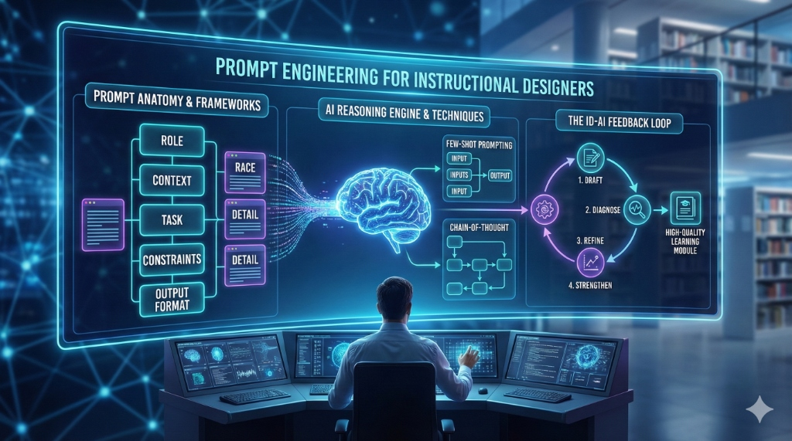

# Prompt Engineering for Instructional Designers

In Chapter 1, we learned that LLMs are "reasoning engines." To get the best results from these engines, we must provide high-quality fuel: **prompts**. Prompt engineering is the process of structured communication that guides the AI toward accurate, relevant, and pedagogically sound outputs.

## 1. The Anatomy of a High-Quality Prompt

A vague prompt ("Write a lesson plan about history") leads to a generic output. A high-quality prompt contains several key elements:

- **Role**: Define the AI's persona (e.g., "Act as a Senior Instructional Designer with 20 years of experience in corporate training").
- **Context**: Provide background (e.g., "The audience is first-line managers at a global tech company who have limited time for training").
- **Task**: The specific action (e.g., "Draft a 15-minute microlearning module on 'Giving Difficult Feedback'").
- **Constraints**: What the AI should *not* do or specific limits (e.g., "Keep the reading level at Grade 8. Do not use jargon. Use only evidence-based feedback models").
- **Output Format**: How the content should look (e.g., "Format the output as a Markdown table with three columns: Concept, Learner Activity, and Timing").

## 2. Prompting Frameworks for ID

Standardizing your prompts makes your workflow repeatable and scaleable. Two effective frameworks for IDs are:

### The RACE Model
A widely used framework that helps categorize the essential components of a prompt:
- **R**ole: Who the AI is.
- **A**ction: What it needs to do.
- **C**ontext: The background info.
- **E**xpectations: The final quality and format.

### The DETAIL Method
Focuses on the granular needs of a learning module:
- **D**omain: The subject area.
- **E**xamples: Providing specific samples (Few-Shot prompting).
- **T**arget audience.
- **A**ssessment: How the learning will be measured.
- **I**ntent: The "Why" behind the content.
- **L**imits: Constraints and boundaries.

## 3. Advanced Techniques

Once you master the basics, you can use advanced techniques to handle complex design tasks.

### Few-Shot Prompting
Instead of just asking for a lesson plan, provide 1-2 examples of previous lesson plans you’ve written. This "grounds" the model in your specific style and voice.

### Chain-of-Thought (CoT)
Add the instruction **"Think step-by-step"** or "Outline your reasoning before providing the final answer." This encourages the model to break down complex tasks into smaller, logical steps, significantly reducing hallucinations.

### Recursive Self-Improvement
Ask the AI to critique its own work. 
*Example Prompt*: "Review the microlearning draft you just provided. Identify any areas where the learning objectives are not met, and then rewrite the draft to address those gaps."

## 4. The ID-AI Feedback Loop

Prompt engineering is rarely a "one-and-done" task. It is an iterative loop:
1.  **Draft**: Create your initial prompt.
2.  **Diagnose**: Review the output for misalignment or generic content.
3.  **Refine**: Add constraints, change the persona, or provide more context.
4.  **Strengthen**: Polish the final version for the specific learner needs.

---

### Hands-On Exercise
Using the **RACE Model**, draft a prompt to generate a 5-question multiple-choice quiz based on a specific paragraph from Chapter 1. Then, refine the prompt by adding a constraint to "provide feedback for both correct and incorrect answers."
