# Prompt Engineering for Instructional Designers

In Chapter 1, we learned that LLMs are "reasoning engines." To get the best results from these engines, we must provide high-quality fuel: **prompts**. Prompt engineering is the process of structured communication that guides the AI toward accurate, relevant, and pedagogically sound outputs.

!!! tip "The ID Advantage"
    As instructional designers, you already have the core skills for prompt engineering: breaking down complex topics, writing clear instructions, and anticipating learner (user) confusion. Prompting is just applying ID skills to a new audience—the AI.

---

## 1. The Anatomy of a High-Quality Prompt

A vague prompt ("Write a lesson plan about history") leads to a generic output. A high-quality prompt contains several key elements:

```mermaid
flowchart TB
    A[High-Quality Prompt] --> B[🎭 Role]
    A --> C[📋 Context]
    A --> D[🎯 Task]
    A --> E[🚫 Constraints]
    A --> F[📄 Output Format]
    
    B --> B1["Who should the AI be?"]
    C --> C1["What's the background?"]
    D --> D1["What specific action?"]
    E --> E1["What to avoid?"]
    F --> F1["How should it look?"]
```



### The Five Essential Elements

| Element | Description | Example |
|---------|-------------|---------|
| **🎭 Role** | Define the AI's persona and expertise | "Act as a Senior Instructional Designer with 20 years of experience in healthcare compliance training" |
| **📋 Context** | Provide background about the situation | "The audience is busy nurses who have 10 minutes max for training, work rotating shifts, and are skeptical of online learning" |
| **🎯 Task** | The specific action you need | "Draft a 10-minute microlearning module on 'Hand Hygiene Protocol Updates'" |
| **🚫 Constraints** | What the AI should NOT do or limits | "Keep reading level at Grade 8. Use no medical jargon. Focus only on the 3 new protocol changes" |
| **📄 Output Format** | How the content should be structured | "Format as a Markdown document with: Learning Objectives, Content Sections (3 max), Knowledge Check (3 questions), and Key Takeaways" |

### ❌ Before vs. ✅ After

=== "❌ Weak Prompt"
    ```
    Write a lesson about giving feedback.
    ```
    
    **Result**: Generic, textbook-style content that could apply to anyone.

=== "✅ Strong Prompt"
    ```
    ROLE: You are a Senior Instructional Designer with 20 years of experience 
    creating leadership training for Fortune 500 companies.
    
    CONTEXT: 
    - Audience: First-line managers at a global tech company
    - They manage remote teams across 3+ time zones
    - Average tenure: 6 months in role
    - They have 15 minutes max for this training
    - Previous feedback training had low engagement scores
    
    TASK: Draft a 15-minute microlearning module on "Giving Difficult Feedback 
    in Remote Settings"
    
    CONSTRAINTS:
    - Reading level: Grade 8
    - No corporate jargon
    - Use only evidence-based feedback models (SBI, COIN, etc.)
    - Include at least 2 realistic remote work scenarios
    
    OUTPUT FORMAT:
    - Learning Objectives (3 max, using Bloom's verbs)
    - Introduction (2 paragraphs)
    - Core Content (3 sections with headers)
    - Practice Scenario (branching decision)
    - Key Takeaways (bullet points)
    - Knowledge Check (3 questions)
    ```
    
    **Result**: Specific, audience-appropriate content ready for refinement.

---

## 2. Prompting Frameworks for ID

Standardizing your prompts makes your workflow repeatable and scalable. Here are two effective frameworks:

### The RACE Model

The most versatile framework for quick, everyday prompts:

| Letter | Meaning | Question to Ask |
|--------|---------|-----------------|
| **R** | Role | Who should the AI be? What expertise? |
| **A** | Action | What specific task should it complete? |
| **C** | Context | What background information is relevant? |
| **E** | Execution | What format, style, length, and constraints? |

> [!TIP]
> **Memory trick**: Think of a RACE—you need to know who's running (Role), what they're doing (Action), what track/conditions (Context), and the rules (Execution).

### The DETAIL Method

Specifically designed for learning content development:

| Letter | Focus | Example Prompt Addition |
|--------|-------|------------------------|
| **D** | Domain | "The subject is OSHA ladder safety regulations" |
| **E** | Examples | "Here are 2 examples of our current training style: [paste examples]" |
| **T** | Target audience | "New warehouse employees, 18-25 years old, high school education" |
| **A** | Assessment | "Learners will be tested via practical demonstration" |
| **I** | Intent | "The goal is to reduce ladder-related injuries by 50%" |
| **L** | Limits | "Content must fit in 3 minutes. No text-heavy slides." |

---

## 3. Advanced Techniques

Once you master the basics, use these techniques for complex design tasks:

### Few-Shot Prompting

Instead of describing what you want, **show it**. Provide 1-2 examples of your desired output.

=== "Zero-Shot (Basic)"
    ```
    Write a learning objective for a module on project management.
    ```

=== "Few-Shot (Better)"
    ```
    Write a learning objective for a module on project management.
    
    Use the same format as these examples:
    
    Example 1: "By the end of this module, learners will be able to identify 
    three types of communication barriers in remote teams and apply at least 
    one mitigation strategy in a simulated scenario."
    
    Example 2: "By the end of this module, learners will be able to calculate 
    the critical path for a project with 8-10 tasks using the provided template."
    
    Now write one for: Creating a Work Breakdown Structure (WBS)
    ```

### Chain-of-Thought (CoT)

Add "Think step-by-step" to reduce hallucinations and improve complex reasoning:

```
You are designing a competency-based assessment for electrician apprentices.

Think step-by-step:
1. First, identify the key competencies for a Level 2 apprentice
2. Then, determine which competencies can be assessed via written test vs. 
   practical demonstration
3. Next, draft 3 assessment items for each category
4. Finally, create a rubric for the practical demonstrations

Show your reasoning at each step.
```

### Recursive Self-Improvement

Ask the AI to critique and improve its own work:

```
[First prompt generates content]

Now review the microlearning draft you just provided:
1. Rate each learning objective against Bloom's taxonomy (is it truly measurable?)
2. Identify any areas where the content doesn't directly support an objective
3. Check if the scenarios are realistic for the target audience
4. Rewrite the draft addressing any gaps you identified
```

### Meta-Prompting: AI as Prompt Engineer

Let the AI help you write better prompts:

```
I want to create training content but I'm not sure how to prompt effectively.

Act as an expert Prompt Engineer specializing in instructional design.

Ask me 5 clarifying questions about:
- My target audience
- The learning outcomes I need
- Constraints I'm working with
- My desired output format
- Any examples I can provide

Then write an optimized prompt for me to use.
```

### Persona Chaining

Use different AI "roles" in sequence for better results:

```mermaid
flowchart LR
    A[SME Persona] -->|Raw content| B[ID Persona]
    B -->|Structured draft| C[Editor Persona]
    C -->|Polished content| D[QA Persona]
    D -->|Final output| E[✅ Ready]
```



**Example workflow**:
1. **SME**: "As a compliance expert, explain the key changes in the 2025 HIPAA updates"
2. **ID**: "As an instructional designer, convert this SME content into a 10-minute module"
3. **Editor**: "As an editor, simplify this to 8th-grade reading level"
4. **QA**: "As a quality reviewer, check this content for accuracy and clarity"

---

## 4. Prompt Library: ID-Specific Templates

### Learning Objectives Generator

```
ROLE: Expert instructional designer certified in Bloom's Taxonomy application

ACTION: Generate [NUMBER] measurable learning objectives

CONTEXT:
- Topic: [TOPIC]
- Audience: [DESCRIBE LEARNERS]
- Module duration: [TIME]
- This is part of a larger [PROGRAM/COURSE NAME]
- Prerequisites: [WHAT LEARNERS ALREADY KNOW]

EXECUTION:
- Use action verbs from Bloom's Taxonomy (prioritize Apply, Analyze, Evaluate)
- Format: "By the end of this module, learners will be able to [VERB] + [OBJECT] + [CONDITION/CRITERIA]"
- Include Bloom's level in parentheses
- Ensure objectives are observable and measurable
- Avoid vague verbs like "understand" or "learn"
```

### Scenario-Based Learning Builder

```
ROLE: Instructional designer specializing in scenario-based learning for 
adult professionals

ACTION: Create a realistic branching scenario

CONTEXT:
- Topic: [TOPIC]
- Skill being practiced: [SPECIFIC SKILL]
- Audience: [JOB ROLE, EXPERIENCE LEVEL]
- Industry: [INDUSTRY]
- Common mistakes learners make: [LIST 2-3]

EXECUTION:
- Create a realistic workplace situation with named characters
- Include 3 decision points
- Each decision has 2-3 options with realistic consequences
- Make incorrect options tempting (common misconceptions)
- Include dialogue and emotional context
- End with a debrief connecting actions to learning objectives

FORMAT:
## Scenario: [TITLE]
### Setup
[Narrative]

### Decision Point 1
[Situation]
- Option A: [action] → [consequence]
- Option B: [action] → [consequence]
- Option C: [action] → [consequence]

[Continue for all decision points]

### Debrief
[Learning connections]
```

### Assessment Question Generator

```
ROLE: Assessment specialist with expertise in creating valid, reliable test items

ACTION: Generate [NUMBER] assessment questions

CONTEXT:
- Content being assessed: [PASTE CONTENT OR DESCRIBE]
- Bloom's level to target: [APPLICATION/ANALYSIS/EVALUATION]
- Question types needed: [MULTIPLE CHOICE / SCENARIO / TRUE-FALSE / SHORT ANSWER]

EXECUTION:
- For multiple choice: 4 options, 1 correct, 3 plausible distractors
- Distractors should reflect common misconceptions, not obvious errors
- Include rationale for correct answer
- Include explanation for why each distractor is wrong
- Align each question to a specific learning objective

FORMAT:
**Question [#]:** [Question text]
A) [Option]
B) [Option]
C) [Option]
D) [Option]

**Correct Answer:** [Letter]
**Rationale:** [Why this is correct]
**Distractor Analysis:**
- A: [Why learners might choose this / what misconception it represents]
- B: [...]
```

### Storyboard Formatter

```
ROLE: eLearning developer experienced with rapid authoring tools

ACTION: Convert this content into a storyboard format

CONTENT:
[PASTE YOUR RAW CONTENT]

EXECUTION:
Format as a table with these columns:
| Screen # | Visual/Layout | On-Screen Text | Narration | Interaction | Notes |

Requirements:
- Maximum 40 words of on-screen text per screen
- Narration should expand on (not repeat) on-screen text
- Include at least 1 interaction every 3 screens
- Suggest relevant stock image descriptions for visuals
- Flag any content that would benefit from animation
```

---

## 5. From Prompts to Agents

In 2025, we are moving beyond single-turn prompts to **Agentic Workflows**.

| Approach | Description | Example |
|----------|-------------|---------|
| **Prompt** | Single input/output interaction | "Write a quiz question" |
| **Agent** | System given a goal that plans and executes multiple steps | "Create a complete lesson on Ladder Safety" |

An agent working on "Create a complete lesson on Ladder Safety" might:

1. Research current OSHA regulations
2. Outline the key learning topics
3. Draft the content for each section
4. Generate practice scenarios
5. Create assessment questions
6. Check all content against learning objectives
7. Format for the target authoring tool

This connects directly to your evolving role as a **Learning Architect** (see [Chapter 7](07-leading-ai-transformation.md)).

---

## 6. Structured Data for Automation

Text is great for reading, but systems need structured data. To integrate AI into your LMS or authoring tools:

### JSON for Quiz Import

```
Format this quiz as JSON compatible with LMS import:
{
  "questions": [
    {
      "type": "multiple_choice",
      "question": "...",
      "options": ["A", "B", "C", "D"],
      "correct": "B",
      "feedback_correct": "...",
      "feedback_incorrect": "..."
    }
  ]
}
```

### xAPI Statements

```
Generate xAPI statements for this scenario:
- Learner starts the module
- Learner completes the video (duration: 4 minutes)
- Learner attempts quiz (score: 80%)
- Learner passes the module

Include: actor, verb, object, result, and timestamp format.
```

### CSV for Bulk Upload

```
Format this content as CSV for [LMS NAME] flashcard import:
term,definition,category,difficulty
```

---

## 7. The ID-AI Feedback Loop

Prompt engineering is rarely "one-and-done." It's iterative:


### Common Issues and Fixes

| Problem | Likely Cause | Fix |
|---------|-------------|-----|
| Too generic | Weak context/audience info | Add specific learner details |
| Too long | No length constraints | Add word/section limits |
| Wrong tone | No style guidance | Add tone examples or descriptors |
| Off-topic | Task not specific enough | Narrow the action statement |
| Hallucinations | Asking beyond AI's knowledge | Use RAG or provide source content |
| Inconsistent format | No format specification | Add explicit output structure |

---

## 8. Common Mistakes to Avoid

!!! warning "Prompt Engineering Pitfalls"
    
    **❌ Being vague about audience**  
    "Write for employees" → "Write for new hires with < 3 months tenure who have no prior industry experience"
    
    **❌ Skipping constraints**  
    AI will write 2,000 words if you don't specify limits.
    
    **❌ Asking for opinions on strategy**  
    AI is great for drafts, not for deciding IF training is the right solution.
    
    **❌ Trusting without verifying**  
    Always fact-check statistics, citations, and technical accuracy.
    
    **❌ Starting over instead of iterating**  
    Refine your prompt; don't abandon it after one attempt.

---

## Hands-On Exercise: Building Your Prompt Library

**Goal**: Create 3 reusable prompts for your most common tasks.

### Step 1: Identify Your Top 3 Tasks
What do you create most often? Examples:
- Learning objectives
- Scenario scripts
- Quiz questions
- Job aids
- Email communications

### Step 2: Draft Using RACE
For each task, write a template using the RACE framework with placeholders for variable information (marked with [BRACKETS]).

### Step 3: Test and Refine
Run each prompt with real content. Note what works and what needs adjustment.

### Step 4: Document and Share
Save your refined prompts in a shared location. Consider adding:
- When to use this prompt
- Variables to customize
- Tips for best results
- Example output

---

## Summary: Key Takeaways

!!! success "Chapter 2 Essentials"
    
    1. **Structure matters**: Use RACE or DETAIL frameworks consistently
    2. **Show, don't just tell**: Few-shot prompting with examples beats descriptions
    3. **Iterate**: Refine prompts through the feedback loop
    4. **Think in systems**: Move from prompts → agents for complex projects
    5. **Build a library**: Create reusable templates for common tasks

---

### What's Next?

Mastering individual prompts is the first step. In **[Chapter 3: The ID-AI Workflow](03-id-ai-workflow.md)**, we will scale these techniques across the entire instructional design lifecycle, reimagining the ADDIE model for the age of AI.

---

*References:*

- Mollick, E. (2024). *Co-Intelligence: Living and Working with AI*. Portfolio.
- OpenAI (2024). *GPT Best Practices*. 
- Anthropic (2024). *Claude Prompt Engineering Guide*.

