# The ID-AI Workflow: Augmenting ADDIE

In **[Chapter 2](02-prompt-engineering.md)**, we mastered the tactical skill of prompt engineering. Now, we apply those skills strategically to the ADDIE model—the gold standard of instructional design for decades. AI doesn't replace ADDIE; it **supercharges** every phase.

```mermaid
flowchart LR
    A[📊 Analyze] --> B[🎨 Design]
    B --> C[🔨 Develop]
    C --> D[🚀 Implement]
    D --> E[📈 Evaluate]
    E -.-> A
    
    A1[AI: Summarize data<br>Identify gaps] --> A
    B1[AI: Draft objectives<br>Zero-draft prototypes] --> B
    C1[AI: Generate content<br>Create media] --> C
    D1[AI: Power tutors<br>Personalize paths] --> D
    E1[AI: Predict outcomes<br>Suggest refinements] --> E
```



---

## 1. Analysis: From Weeks to Hours

In traditional workflows, analysis can take weeks. AI compresses this dramatically.

### What AI Does in Analysis

| Task | Traditional | AI-Augmented |
|------|-------------|--------------|
| SME Interview Synthesis | 8+ hours transcribing/summarizing | 30 minutes with auto-transcription |
| Survey Analysis | Manual coding of themes | Instant sentiment analysis |
| Gap Identification | Subject matter expertise required | AI scans documents for missing competencies |
| Learner Personas | Assumptions and limited data | Data-driven synthetic personas |

### Practical Prompt: Needs Analysis Synthesis

```
ROLE: Senior learning consultant with expertise in needs analysis

ACTION: Analyze the following interview transcript and identify training needs

CONTEXT:
[PASTE SME INTERVIEW TRANSCRIPT]

EXECUTION:
Provide:
1. KEY THEMES (5 max): What topics came up repeatedly?
2. SKILL GAPS MENTIONED: What do employees struggle with?
3. PRIORITY RANKING: High/Medium/Low urgency for each gap
4. RECOMMENDED OBJECTIVES: Draft 3 learning objectives based on gaps
5. POTENTIAL BARRIERS: What might prevent successful training?

Format as a structured report I can share with stakeholders.
```

### Advanced: Predictive Needs Analysis

Beyond analyzing existing gaps, AI can **predict** future performance issues:

```
Analyze this data to predict emerging training needs:

DATA SOURCES:
- Customer complaint trends (last 6 months): [SUMMARY]
- Employee error rates by department: [SUMMARY]
- Upcoming product/policy changes: [LIST]
- Competitor landscape shifts: [SUMMARY]

TASK: Identify 3 training topics we should proactively develop 
before problems manifest. Explain your reasoning.
```

---

## 2. Design: AI as Your Brainstorming Partner

The design phase is where the ID-AI "Co-Intelligence" loop really shines.

### The Zero-Draft Revolution

!!! info "What is Zero-Drafting?"
    Instead of spending weeks creating detailed storyboards, use AI to generate a functional "Draft Zero" prototype immediately. Stakeholders react to a living course draft rather than static documents—dramatically shortening feedback loops.


### Practical Prompt: Learning Objective Mapping

```
ROLE: Instructional design expert certified in Bloom's Taxonomy

ACTION: Create a complete learning objective map for a training module

CONTEXT:
- Topic: [TOPIC]
- Duration: [TIME]
- Audience: [DESCRIBE]
- Business Goal: [WHAT BEHAVIOR CHANGE IS NEEDED?]
- Constraints: [ANY LIMITS ON APPROACH]

EXECUTION:
Provide:
1. TERMINAL OBJECTIVE: The overarching goal
2. ENABLING OBJECTIVES (3-5): Supporting objectives with Bloom's level
3. KNOWLEDGE CHECK ALIGNMENT: How each objective will be assessed
4. MODULE OUTLINE: Suggested section structure
5. ENGAGEMENT STRATEGY: Recommended activities for each section

Format as a structured design document.
```

### Practical Prompt: Zero-Draft Course Prototype

```
ROLE: eLearning developer creating rapid prototypes

ACTION: Generate a complete first draft of a training module

CONTEXT:
- Topic: [TOPIC]
- Duration: [TIME] (e.g., "15 minutes")
- Audience: [WHO]
- Key Learning Points: [LIST 3-5]
- Tone: [FORMAL/CONVERSATIONAL/MOTIVATIONAL]

EXECUTION:
Create a complete draft including:
1. ATTENTION HOOK: Opening that captures interest (60 seconds)
2. LEARNING OBJECTIVES: What they'll be able to do
3. CONTENT SECTIONS: 3 sections with headers, key points, examples
4. PRACTICE ACTIVITY: 1 scenario-based exercise
5. KNOWLEDGE CHECK: 3 assessment questions
6. SUMMARY: Key takeaways and next steps

Format ready for stakeholder review.
```

---

## 3. Development: 50% Faster Production

This is the most visible area of AI impact. Teams using AI report significant reductions in development time.

### The AI-Augmented Development Stack

| Content Type | Traditional Time | AI-Assisted Time | Tools |
|--------------|-----------------|-----------------|-------|
| Script Writing | 4-8 hours | 30-60 min | ChatGPT, Claude |
| Video Narration | 1-2 days (scheduling, recording) | 1-2 hours | ElevenLabs, Murf.ai |
| Video Production | 2-3 days | 2-4 hours | Synthesia, HeyGen |
| Quiz Generation | 2-4 hours | 20-30 min | AI + LMS import |
| Job Aids | 2-4 hours | 30-60 min | Canva AI, ChatGPT |

### Practical Prompt: Scenario Script Generator

```
ROLE: Scenario-based learning specialist for corporate training

ACTION: Write a branching scenario script for eLearning

CONTEXT:
- Topic: [TOPIC]
- Skill: [WHAT LEARNERS ARE PRACTICING]
- Setting: [WORKPLACE CONTEXT]
- Characters: [JOB ROLES INVOLVED]
- Common Mistakes: [WHAT DO LEARNERS TYPICALLY DO WRONG?]

EXECUTION:
Create a script with:
- SETUP: 2-3 paragraphs establishing the situation
- CHARACTER DIALOGUE: Realistic workplace conversation
- DECISION POINT 1: 3 options with distinct consequences
- PATHWAY A (correct): What happens, why it's right
- PATHWAY B (common mistake): Realistic consequence, learning moment
- PATHWAY C (worse choice): Clear negative outcome
- CONCLUSION: Debrief connecting to learning objectives

Format as a screenplay-style script.
```

### Practical Prompt: Assessment Generator

```
ROLE: Assessment design specialist

ACTION: Create a comprehensive assessment for this content

CONTENT:
[PASTE MODULE CONTENT OR LEARNING OBJECTIVES]

REQUIREMENTS:
- 3 knowledge-check questions (recall level)
- 2 application questions (scenario-based)
- 1 analysis question (comparing/contrasting)

For each question:
- Include 4 answer options
- Mark the correct answer
- Explain why correct answer is right
- Explain the misconception behind each distractor

Format ready for LMS import.
```

---

## 4. Implementation: From Static to Adaptive

AI transforms implementation from delivering fixed content to providing personalized learning experiences.

### The Adaptive Learning Stack

```mermaid
flowchart TD
    A[Learner Starts] --> B{Prior Knowledge?}
    B -->|Low| C[Foundation Path]
    B -->|Medium| D[Standard Path]
    B -->|High| E[Accelerated Path]
    
    C --> F[AI Tutor Support]
    D --> F
    E --> F
    
    F --> G{Struggling?}
    G -->|Yes| H[Additional Resources]
    G -->|No| I[Continue]
    H --> I
    
    I --> J[Assessment]
    J --> K{Pass?}
    K -->|Yes| L[✅ Complete]
    K -->|No| M[Remediation Loop]
    M --> C
```



### AI Implementation Tools

| Application | How It Works | Example |
|-------------|--------------|---------|
| **AI Tutors** | Socratic questioning without giving answers | "What do you think might happen if you skip Step 3?" |
| **24/7 Support Bots** | Answer FAQs, guide to resources | "I see you're stuck on the certification exam. Here are practice questions." |
| **Adaptive Pathing** | Adjust content based on performance | Pre-test skips mastered content |
| **Just-in-Time Learning** | Serve content at the moment of need | Mobile job aid triggered by QR code at workstation |

### Practical Prompt: AI Tutor System Prompt

```
You are a Socratic learning coach helping employees understand [TOPIC].

RULES:
1. Never give direct answers to questions covered in training
2. Instead, ask guiding questions that lead the learner to discover answers
3. If they're frustrated (3+ wrong attempts), offer a hint
4. Celebrate progress with specific praise
5. Always relate concepts back to their daily work
6. Flag to human instructor if stuck for more than 5 minutes

KNOWLEDGE BASE:
[PASTE KEY CONTENT OR CONNECT TO RAG SYSTEM]

TONE: Supportive, patient, encouraging. Like a helpful colleague.
```

---

## 5. Evaluation: Predictive Rather Than Reactive

Traditional evaluation waits until the course ends. AI enables continuous, predictive evaluation.

### Evaluation Evolution

| Metric | Traditional | AI-Enhanced |
|--------|-------------|-------------|
| Completion Rates | End-of-course report | Real-time dashboard with predictions |
| Learning Effectiveness | Post-assessment scores | Continuous micro-assessments |
| Behavior Change | 90-day follow-up surveys | Performance data correlation |
| Content Quality | Annual review | AI-flagged problem areas in real-time |

### Practical Prompt: Evaluation Analysis

```
ROLE: Learning analytics specialist

ACTION: Analyze this training evaluation data and provide insights

DATA:
- Completion rate: [X%]
- Average quiz score: [X%]
- Questions with lowest scores: [LIST]
- Drop-off points: [WHERE DO PEOPLE QUIT?]
- Learner comments: [PASTE SAMPLE]
- Time spent vs. estimated: [COMPARISON]

PROVIDE:
1. KEY INSIGHTS: What's working well?
2. PROBLEM AREAS: What needs attention?
3. ROOT CAUSE HYPOTHESIS: Why might these issues exist?
4. RECOMMENDED ACTIONS: Prioritized list of improvements
5. CONTENT REVISIONS: Specific changes to consider

Format as an executive summary (1 page) + detailed appendix.
```

---

## 6. The Human Quality Gate

!!! warning "Critical Checkpoint"
    No AI output should be released without passing through human-led quality gates. AI accelerates production; humans ensure quality.

```mermaid
flowchart LR
    A[AI Draft] --> B{Accuracy Audit}
    B -->|Fail| A
    B -->|Pass| C{Voice & Tone}
    C -->|Fail| A
    C -->|Pass| D{Pedagogy Check}
    D -->|Fail| A
    D -->|Pass| E{Bias Review}
    E -->|Fail| A
    E -->|Pass| F[✅ Approved]
```



### The Four Quality Gates

| Gate | Questions to Ask | Who Reviews |
|------|------------------|-------------|
| **1. Accuracy** | Are facts correct? Citations valid? Can an SME verify? | Subject Matter Expert |
| **2. Voice & Tone** | Does it sound like our organization? Appropriate for audience? | ID Lead / Brand |
| **3. Pedagogy** | Will this actually cause behavior change? Activities aligned to objectives? | Senior ID |
| **4. Bias & Inclusion** | Any stereotypes? Exclusionary language? Accessible to all? | D&I Review / Accessibility |

---

## Summary: The Augmented ADDIE

| Stage | Traditional Task | AI-Augmented Task | Time Savings |
|-------|-----------------|-------------------|--------------|
| **Analysis** | Manual survey analysis | Predictive analytics & gap analysis | 70-80% |
| **Design** | Weeks of storyboarding | Zero-Drafting & rapid prototyping | 60-70% |
| **Development** | Months of content creation | AI-assisted multimedia production | 50-60% |
| **Implementation** | Static content delivery | Adaptive, tutor-supported journeys | N/A (quality gain) |
| **Evaluation** | End-of-course reports | Real-time predictive analytics | 50-60% |
| **QA** | Typo & link checking | Human Quality Gate (Accuracy & Bias) | N/A (essential) |

---

## Hands-On Exercise: The Zero-Draft Challenge

**Goal**: Experience the speed of AI-augmented design.

### Part 1: Traditional (10 minutes)
1. Choose a 5-minute topic (e.g., "How to Reset Your Password")
2. Set a timer for 10 minutes
3. Sketch a storyboard by hand: learning objectives, 3-4 screens, assessment

### Part 2: AI-Augmented (10 minutes)
1. Same topic
2. Set a timer for 10 minutes
3. Use this prompt:

```
Create a complete 5-minute eLearning module on "How to Reset Your Password" 
for new employees at a tech company.

Include:
- 2 learning objectives
- Attention hook (why this matters)
- Step-by-step content (with common mistakes to avoid)
- 1 practice scenario
- 2 knowledge check questions
- Key takeaways

Format as a storyboard with screen-by-screen breakdown.
```

### Part 3: Compare

| Criteria | Traditional Draft | AI Draft |
|----------|------------------|----------|
| Completeness | | |
| Time to "client-ready" | | |
| Quality of examples | | |
| Assessment alignment | | |
| Your unique value added | | |

??? question "Reflection Questions"
    - Which output is closer to being "client-ready"?
    - How much editing does the AI draft need?
    - Where did you add value that the AI couldn't?
    - How might you use this approach on your next project?

---

*References:*

- Courseau (2025). *Accelerating Course Development with AI*.
- Devlin Peck (2025). *AI in Instructional Design*.
- Disco (2025). *AI for Instructional Design: Using the ADDIE Model*.
- Shift eLearning (2025). *The Future of Instructional Design in the AI Era*.
- University of Cincinnati (2025). *How Instructional Designers Use AI*.

---

### What's Next?

Theory and process are essential, but seeing AI in action is where the transformation becomes real. In **[Chapter 4: Case Studies](04-case-studies.md)**, we will explore real-world success stories from organizations like Georgia Tech, IBM, and Walmart.

