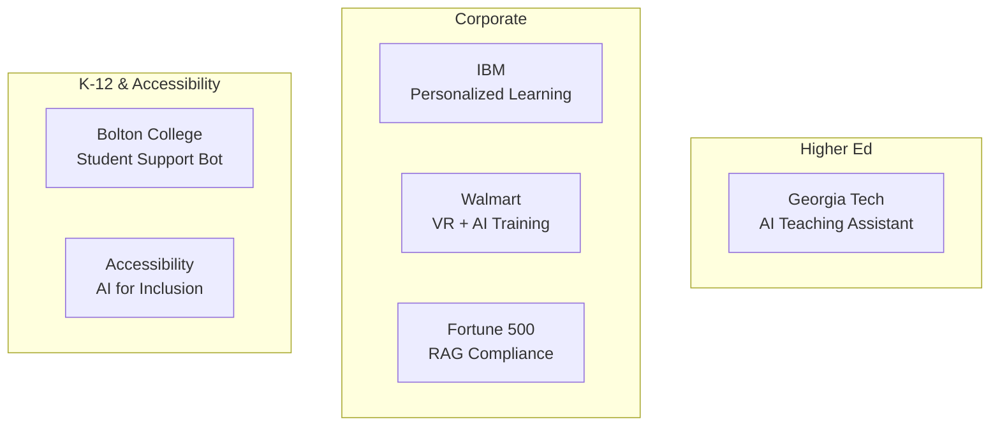
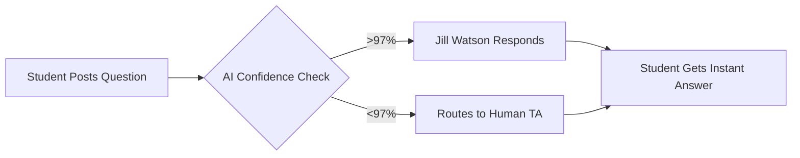
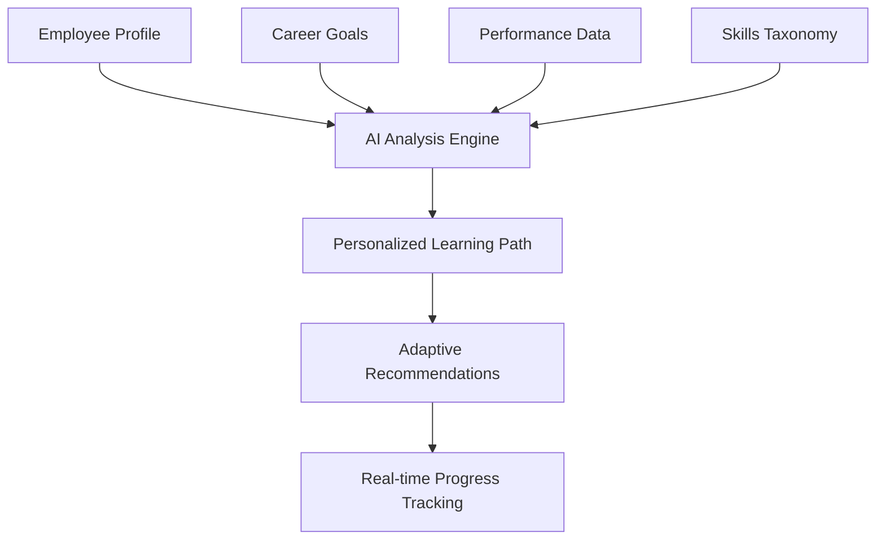
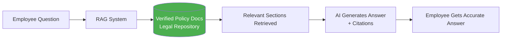
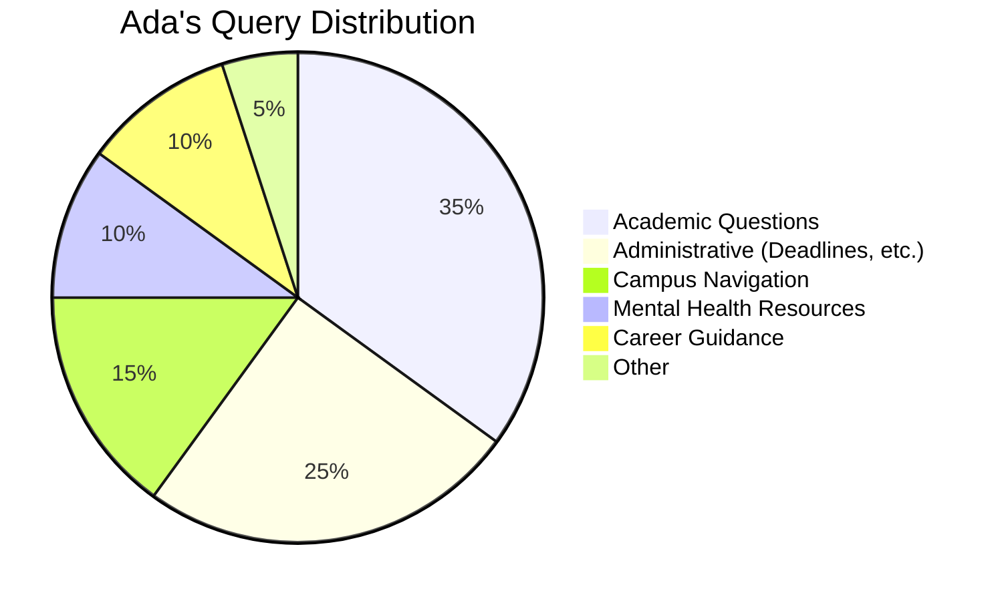
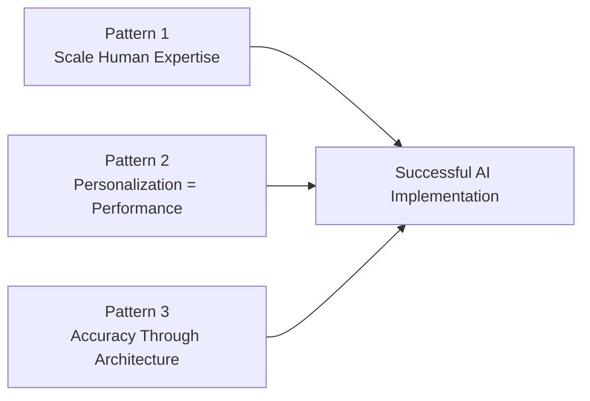

# Case Studies and Practical Examples

In **[Chapter 3](03-id-ai-workflow.md)**, we explored the augmented ADDIE model. To understand the true power of AI-powered instructional design, we must look beyond the tools and frameworks to the real-world impact. This chapter highlights how organizations in corporate, higher education, and K-12 sectors are using AI to solve complex learning challenges.

!!! tip "How to Use These Case Studies"
    Each case follows a consistent format: Challenge → Solution → Results → Lessons Learned. As you read, note which patterns might apply to your context.

---

## Case Study Matrix



---

## 1. Higher Education: AI Teaching Assistants

### Case Study: Georgia Tech's "Jill Watson"

One of the most famous examples of AI in education, Georgia Tech deployed an AI teaching assistant in their online Master's program.

| Aspect | Details |
|--------|---------|
| **Organization** | Georgia Institute of Technology |
| **Program** | Online Master's in Computer Science |
| **Year Launched** | 2016 (evolved through 2024) |
| **AI Technology** | IBM Watson → Custom LLM |

#### The Challenge

- **Volume**: 400+ students per semester generating thousands of forum posts
- **Repetition**: 40% of questions were answered in previous semesters
- **TA Burnout**: Human TAs spending 80% of time on routine queries
- **Response Time**: Students waiting 24-48 hours for basic answers

#### The Solution



An AI teaching assistant named "Jill Watson" was trained on:
- 10+ semesters of forum Q&A data
- Syllabus and course materials
- Rubrics and deadline information

#### The Results

| Metric | Before | After |
|--------|--------|-------|
| Response Time | 24-48 hours | < 1 minute |
| TA Time on Routine Qs | 80% | 20% |
| Student Satisfaction | Baseline | No change (couldn't tell it was AI) |
| Questions Handled by AI | 0% | 40% of volume |

#### Lessons Learned

!!! info "Key Takeaways from Georgia Tech"
    
    **1. The 97% Confidence Threshold**  
    Jill was programmed to only respond when confidence exceeded 97%. Below that, questions went to humans. This prevented embarrassing mistakes.
    
    **2. Data Freshness is Critical**  
    Jill's accuracy directly correlated with how recently the training data was updated. Outdated syllabus = wrong answers.
    
    **3. Transparency Increases Trust**  
    Initially, students didn't know Jill was AI. When Georgia Tech disclosed this, trust *increased* because students appreciated the instant responses.
    
    **4. The ID Became a Knowledge Engineer**  
    The instructional designer's role shifted from answering questions to *structuring the data* that Jill required.

---

## 2. Corporate Training: Personalization at Scale

### Case Study: IBM Watson-Powered Learning

IBM uses AI to manage continuous upskilling across a massive global workforce.

| Aspect | Details |
|--------|---------|
| **Organization** | IBM |
| **Scope** | 350,000+ employees globally |
| **Challenge** | Diverse skill needs, rapid technology changes |
| **AI Application** | Personalized learning path recommendations |

#### The Challenge

- **One-Size-Fits-All Failure**: Generic training had poor completion rates
- **Skill Diversity**: 350,000 employees with vastly different starting points
- **Rapid Obsolescence**: Technical skills becoming outdated within 18 months
- **Career Mobility**: Employees wanted visible skill development paths

#### The Solution



The system integrates:
- Individual skill assessments
- Career goal declarations
- Performance review data
- Job market trends
- Internal mobility opportunities

#### The Results

| Metric | Improvement |
|--------|-------------|
| Time-to-competency | 40% faster |
| Course completion rates | 2x increase |
| Internal job fills | 30% increase |
| Learning hours per employee | 50+ hours/year average |

#### Lessons Learned

!!! info "Key Takeaways from IBM"
    
    **1. Taxonomy is King**  
    The AI's recommendations were only as good as the underlying skills taxonomy. IDs spent months defining what "Expertise" looked like in standardized terms.
    
    **2. Personalization ≠ Isolation**  
    Despite AI-driven paths, IBM found that social learning (human mentors, cohort experiences) was still essential and couldn't be replaced.
    
    **3. Trust Requires Transparency**  
    Employees needed to understand *why* certain courses were recommended to accept the AI's guidance.

---

### Case Study: Walmart VR + AI Training

Walmart combines Virtual Reality with AI to train frontline associates on high-pressure scenarios.

| Aspect | Details |
|--------|---------|
| **Organization** | Walmart |
| **Scope** | 1.5M+ frontline associates |
| **Challenge** | Training for high-stress, rare events |
| **AI Application** | Adaptive VR simulations |

#### The Challenge

- **Black Friday Chaos**: Training for once-a-year events in classroom setting
- **Empathy Skills**: Handling distressed customers is hard to teach via slides
- **Consistency**: 5,000+ stores needing identical training experiences
- **Retention**: Traditional training had low knowledge retention

#### The Solution

Immersive VR simulations where:
- AI "customers" respond dynamically to trainee choices
- Scenarios branch based on decisions
- Stress level adjusts to learner readiness
- Real-time coaching adapts to performance

#### The Results

| Metric | Improvement |
|--------|-------------|
| Test scores | 70% higher |
| Training time | 96% reduction (for some modules) |
| Confidence scores | 30% increase |
| Scale | 1M+ VR training sessions |

#### Lessons Learned

!!! info "Key Takeaways from Walmart"
    
    **1. Hardware Friction is Real**  
    Initial rollout faced challenges with headset maintenance and motion sickness. Solution: Mobile-accessible reinforcement content.
    
    **2. Emotional Realism Matters**  
    AI "customers" needed to be emotionally realistic—frustration, confusion, gratitude. This required sophisticated behavioral modeling.
    
    **3. Safe-to-Fail Environment**  
    VR created psychological safety to make mistakes before facing real customers.

---

### Case Study: Fortune 500 RAG-Powered Compliance

A major technology company implemented RAG for its global compliance training in 2025.

| Aspect | Details |
|--------|---------|
| **Organization** | Fortune 500 Tech Company |
| **Challenge** | Multi-jurisdictional compliance accuracy |
| **AI Application** | RAG-based chatbot for policy queries |

#### The Challenge

- **Hallucination Risk**: Standard chatbots would guess at legal requirements
- **Jurisdictional Complexity**: Different laws in 50+ countries
- **Policy Updates**: Compliance documents changing quarterly
- **24/7 Need**: Employees needing answers at any hour

#### The Solution



Key features:
- AI restricted to *only* answer from approved legal documents
- Every answer includes section/page citations
- Escalation path to human compliance officers
- Automatic flagging when policies are outdated

#### The Results

| Metric | Before | After |
|--------|--------|-------|
| Hallucination rate | 15% (standard LLM) | <2% |
| Average response time | 24 hours (email) | 30 seconds |
| Compliance officer time | 60% on routine Qs | 10% on routine Qs |
| Employee satisfaction | 3.2/5 | 4.6/5 |

#### Lessons Learned

!!! info "Key Takeaways from RAG Implementation"
    
    **1. RAG ≠ Zero Hallucination**  
    Even RAG systems can misinterpret documents. The <2% error rate still required human escalation paths.
    
    **2. Document Quality Matters**  
    AI struggled with poorly formatted PDFs and scanned documents. IDs had to clean up source materials.
    
    **3. User Training Required**  
    Employees needed to learn how to ask good questions—prompt engineering extends to end users.

---

## 3. K-12 & Accessibility

### Case Study: Bolton College (UK) - "Ada" Bot

Bolton College deployed AI to support the entire student lifecycle, not just academics.

| Aspect | Details |
|--------|---------|
| **Organization** | Bolton College, UK |
| **Challenge** | 24/7 student support with limited staff |
| **AI Application** | Multi-purpose student assistant |

#### What Ada Handles



#### Results

- **24/7 Availability**: Students get answers at 2 AM before exams
- **Reduced Admin Burden**: Front desk inquiries down 40%
- **Early Intervention**: AI identifies at-risk students based on query patterns

### AI for Accessibility: Closing Inclusion Gaps

AI is transforming accessibility in learning:

| Application | Tool Example | Impact |
|-------------|--------------|--------|
| **Vision Support** | Be My Eyes + GPT-4 | Real-time audio description of visual content |
| **Dyslexia Support** | AI text simplifiers | Convert dense text to accessible reading levels |
| **Motor Impairment** | Voice-controlled navigation | Full course access without keyboard/mouse |
| **Captioning** | Auto-generated captions | Video accessibility at scale |
| **Translation** | Real-time translation | Multilingual course access |

> [!NOTE]
> AI-generated accessibility features (alt-text, captions) must still be verified by humans for accuracy and context.

---

## 4. When AI Fails: Lessons from the Quality Gate

Case studies often highlight success, but failures teach us more.

### The Pharmacology Quiz Incident

During a 2025 pilot for a medical training module:

| What Happened | Why It Happened | How It Was Caught |
|---------------|-----------------|-------------------|
| AI-generated distractor was actually *clinically correct* in rare cases | AI focused on "plausibility" over "pedagogical intent" | SME review during QA |

**The Fix:**
```
Updated Prompt:
"Ensure all distractors are factually incorrect under ALL clinical 
circumstances. Flag any edge cases where a distractor might be 
considered correct in rare situations."
```

### Common AI Failure Patterns

| Failure Mode | Example | Prevention |
|--------------|---------|------------|
| **Plausible Nonsense** | Technically worded but wrong | SME review requirement |
| **Out-of-Date Info** | Training data cutoff | Verify recency of claims |
| **Cultural Bias** | Western-centric scenarios | Diversity review checklist |
| **Overconfident Errors** | Wrong with no hedging | Request uncertainty indicators |
| **Citation Fabrication** | Invented references | Always verify citations |

---

## 5. Cross-Case Pattern Analysis

Across all case studies, three themes emerge:



### Pattern 1: AI Scales Human Expertise

AI doesn't replace experts—it amplifies their reach:
- Georgia Tech: TAs now focus on complex pedagogy
- IBM: Mentors reach more mentees with AI-enabled matching

### Pattern 2: Personalization Drives Performance

Every case with personalization showed improved outcomes:
- IBM: 40% faster time-to-competency
- K-12 literacy tools: Individual pacing increases retention

### Pattern 3: Accuracy Requires Architecture

Speed without accuracy is dangerous:
- RAG systems drastically reduce hallucination
- Human-in-the-loop QA is non-negotiable for high-stakes content

---

## Apply It: Case Study Analysis Exercise

**Goal**: Analyze a failure to prevent it in your work.

### Step 1: Review the Pharmacology Incident
- Why did the AI generate a "distractor" that was actually correct?
- What does this tell you about AI's understanding of intent vs. pattern?

### Step 2: Draft a Policy
Create a 3-bullet policy statement for your team regarding AI-generated assessments:

??? example "Sample Policy"
    1. All AI-generated assessment items must be reviewed by a qualified SME before use
    2. Distractors must be verified as incorrect under all possible interpretations
    3. High-stakes assessments (certifications, compliance) require additional legal/compliance review

### Step 3: Identify Your Use Cases
Based on the case studies, which pattern best fits your organization?

| Pattern | Characteristics | Example Organizations |
|---------|-----------------|----------------------|
| **Scale Expert Time** | High question volume, repetitive Qs | Support, compliance, onboarding |
| **Personalize Learning** | Diverse skill levels, career paths | Large enterprises, tech companies |
| **Ensure Accuracy** | Regulated industry, safety-critical | Healthcare, finance, legal |

---

*References:*

- Bolton College (2024). *Transforming Online Learning with AI Video*.
- Georgia Institute of Technology (2024). *Jill Watson: The AI Teaching Assistant*.
- IBM (2024). *Personalizing Corporate Learning at Scale with Watson*.
- Miao, X. & Mishra, P. K. (2025). *Preparing Future-Ready Learners: K12 Skills Shift and GenAI EdTech Innovation Direction*.
- Walmart (2024). *Immersive AI Training for Frontline Associates*.

---

### What's Next?

The success stories in this chapter often rely on more than just basic chatbots. In **[Chapter 5: Advanced AI Implementation](05-advanced-ai.md)**, we will look "under the hood" at the technologies that make these results possible, including RAG and autonomous AI Agents.
