# Advanced AI Implementation: Agents & RAG

In Chapter 1, we explored the "hallucination" problem. In Chapter 2, we mastered Prompt Engineering. However, as an Instructional Designer dealing with highly specific proprietary content, you will eventually hit the **Context Ceiling**—the point where prompting alone isn't enough.

This chapter bridges that gap by exploring **Retrieval-Augmented Generation (RAG)** and **Agentic Workflows**—the technologies that power enterprise-grade AI learning systems.

!!! tip "Who This Chapter Is For"
    This chapter is more technical than previous ones. You don't need to code these systems yourself, but understanding how they work helps you:
    - Communicate effectively with technical teams
    - Make informed tool selection decisions
    - Design content that works well with these architectures

---

## 1. What is RAG? (Retrieval-Augmented Generation)

A common problem with LLMs: they're trained on public data. They don't know your company's specific safety protocols, your unique product features, or your internal methodology.

**RAG** solves this by connecting the LLM to a specific "Knowledge Shell" of your proprietary documents.

### The Open-Book Exam Analogy


> [!NOTE]
> RAG is like letting the AI take an **open-book exam** with *your* textbook. It must find the answer in your documents before writing it down.

### How RAG Works: The Technical Loop

```mermaid
flowchart TD
    A[👤 User Question] --> B[🔍 Retrieval System]
    B --> C[(📚 Vector Database<br>Your Documents)]
    C --> D[📄 Relevant Chunks<br>Retrieved]
    D --> E[🧠 LLM + Context]
    E --> F[💬 Grounded Response<br>With Citations]
    
    style C fill:#4CAF50,color:white
    style F fill:#2196F3,color:white
```



| Step | What Happens | Example |
|------|--------------|---------|
| **1. Retrieval** | System searches your documents for relevant chunks | Query: "overtime policy" → Finds pages 24-26 of HR handbook |
| **2. Augmentation** | Relevant chunks attached to the user's question | "Based on these excerpts, answer: What's our overtime policy?" |
| **3. Generation** | LLM generates answer grounded in retrieved content | "According to your policy (p. 25), overtime requires manager approval..." |

### RAG vs. Fine-Tuning: When to Use Each

| Criteria | Use RAG | Use Fine-Tuning |
|----------|---------|-----------------|
| **Primary Need** | Factual accuracy | Specific style/voice |
| **Content Changes** | Frequently (swap documents) | Rarely (retrain model) |
| **Setup Complexity** | Medium | High |
| **Cost** | Lower ongoing | Higher upfront |
| **Best For** | Compliance, product training, policies | Brand voice, specialized jargon |

> [!TIP]
> **For most ID use cases, RAG is superior.** Fine-tuning is only necessary when you need the AI to fundamentally "speak your language"—specialized medical terminology, company-specific writing style, etc.

### Practical Example: Compliance Training RAG

**Scenario**: You're building a compliance chatbot for new hires.

**Without RAG:**
```
User: Can I accept a $75 gift from a vendor?

AI: Generally, most companies allow gifts under $50. You should 
check your company's specific policy.

❌ Generic answer, no specific policy reference
```

**With RAG:**
```
User: Can I accept a $75 gift from a vendor?

AI: According to your company's Ethics Policy (Section 4.2, p. 12):
"Employees may not accept gifts valued over $25 from vendors without 
written approval from their manager and the Ethics Committee."

The $75 gift exceeds this threshold. You would need to:
1. Decline the gift, OR
2. Seek written approval from your manager and Ethics Committee

✅ Specific policy, exact citation, actionable guidance
```

---

## 2. Agentic Workflows: The Power of Delegation

While RAG provides the AI with a "brain" of specific knowledge, **Agentic Workflows** provide the "hands" to execute complex tasks autonomously.

### Prompt vs. Agent

| Approach | How It Works | Example |
|----------|--------------|---------|
| **Prompt** | One input → One output | "Write a quiz question" |
| **Agent** | Goal → AI plans → AI executes → AI refines | "Build a complete module on Safety" |

```mermaid
flowchart TD
    A[👤 You: 'Create a module on Safety'] --> B{🤖 Agent}
    B --> C[1. Research safety regulations]
    B --> D[2. Outline learning objectives]
    B --> E[3. Draft content sections]
    B --> F[4. Generate scenarios]
    B --> G[5. Create assessment]
    B --> H[6. Self-review for gaps]
    H --> I[📦 Complete Module Delivered]
```



### Andrew Ng's Four Agentic Patterns

Andrew Ng (2024) identifies four key patterns for agentic design:

#### Pattern 1: Reflection

The agent critiques its own work before showing you.


**Prompt Example:**
```
After generating the learning objectives, review them against 
Bloom's Taxonomy. Score each objective 1-5 for measurability. 
Rewrite any objectives scoring below 4.
```

#### Pattern 2: Tool Use

The agent decides to use external tools (calculator, search, code) to solve problems.

```mermaid
flowchart LR
    A[Question] --> B{Agent Decision}
    B --> C[🔍 Search Web]
    B --> D[🧮 Run Calculation]
    B --> E[💻 Execute Code]
    B --> F[📊 Query Database]
    C --> G[Synthesized Answer]
    D --> G
    E --> G
    F --> G
```



**ID Application:**
- Agent searches your LMS for existing content before creating new
- Agent queries performance data to identify skill gaps
- Agent runs readability analysis on generated content

#### Pattern 3: Planning

The agent breaks complex goals into task sequences.


#### Pattern 4: Multi-Agent Collaboration

Specialized agents work together like a team.

```mermaid
flowchart TD
    A[📋 Manager Agent] --> B[📝 Writer Agent]
    A --> C[🎓 SME Agent]
    A --> D[🎨 Design Agent]
    A --> E[✅ QA Agent]
    
    B --> F[Draft Content]
    C --> G[Verify Accuracy]
    D --> H[Create Visuals]
    E --> I[Review Output]
    
    F --> J[Final Deliverable]
    G --> J
    H --> J
    I --> J
```



---

## 3. Orchestration Patterns for ID Teams

When building an AI design system, consider these architectural patterns:

### Hierarchical Orchestration

```mermaid
flowchart TD
    A[👤 You: Define Goal] --> B[🎯 Manager Agent]
    B --> C[Worker 1: Research]
    B --> D[Worker 2: Write]
    B --> E[Worker 3: Assess]
    B --> F[Worker 4: Review]
    C --> B
    D --> B
    E --> B
    F --> B
    B --> G[📦 Deliverable to You]
```



**Use When:**
- Complex multi-step projects
- Quality control is essential
- You want a single point of accountability

### Sequential/Chain Orchestration


**Use When:**
- Dependencies are linear
- Each step builds on the previous
- Simpler to debug and monitor

---

## 4. Building Knowledge Shells for ID

A **Knowledge Shell** is a curated repository of documents that grounds your AI in specific, approved content.

### Example: Medical Device Training

```mermaid
flowchart LR
    A[📋 500-Page Technical Manual] --> B[(Knowledge Shell)]
    C[📄 FDA Guidelines] --> B
    D[🎓 Previous Training Materials] --> B
    E[❓ User Error Reports] --> B
    
    B --> F[🤖 ID Agent]
    
    F --> G[Scenario-based Quiz]
    F --> H[Troubleshooting Guide]
    F --> I[Compliance Checklist]
```



**Sample Prompt for Knowledge Shell Agent:**
```
You have access to the XR-500 Medical Device Manual (500 pages).

Task: Identify the 5 most common user errors mentioned in the manual.
For each error:
1. Quote the relevant section (with page number)
2. Explain why this error is dangerous
3. Draft a scenario-based quiz question to test awareness
4. Suggest a preventive training intervention

Only use information from the manual. Do not invent or assume.
```

---

## 5. Semantic Search vs. Keyword Search

Advanced AI changes how learners interact with your content:

| Approach | How It Works | Example Result |
|----------|--------------|----------------|
| **Keyword Search** | Exact word matching | "blinking" → Only finds pages with "blinking" |
| **Semantic Search** | Understanding meaning/intent | "blinking red light" → Finds "Power Fault Condition" chapter even if "blinking" isn't used |


### ID Implications

With semantic search, you can:
- Allow learners to ask questions in natural language
- Surface related content they didn't know to search for
- Connect concepts across modules automatically

---

## 6. Security and Intellectual Property

When implementing advanced AI, security is paramount.

### The Data Flow Risk

```mermaid
flowchart LR
    A[😰 Risk: Your proprietary training content] --> B[Sent to public AI]
    B --> C[Used to train public models]
    C --> D[Appears in competitor's output]
```



### Private LLM Environments

| Deployment Type | Data Security | Cost | Complexity |
|----------------|---------------|------|------------|
| **Public API** (ChatGPT, etc.) | ⚠️ May be used for training | Low | Low |
| **Enterprise Tier** (with DPA) | ✅ Not used for training | Medium | Low |
| **Private Cloud** (Azure, AWS) | ✅ Stays in your tenant | High | Medium |
| **On-Premise** | ✅ Never leaves your servers | Very High | High |

> [!TIP]
> For proprietary training content, always use Enterprise tiers with Data Processing Agreements (DPAs), or private cloud deployments.

### IP Ownership Checklist

Before using any AI tool, verify:

- [ ] Terms of Service specify YOU own the output
- [ ] Your input is NOT used to train public models
- [ ] Data Processing Agreement is in place
- [ ] Compliance with your industry regulations (HIPAA, GDPR, etc.)
- [ ] Export options don't create vendor lock-in

---

## 7. Synthetic Data & Stress-Testing

One of the most powerful advanced uses of AI: generating **Synthetic Data**.

### Stress-Testing Scenarios

**Problem**: You have 50 branching paths in a compliance scenario. How do you verify all paths work?

**Solution**: Use an AI agent to play through the scenario 1,000 times, making different choices each time.

```mermaid
flowchart TD
    A[Scenario Agent] --> B[Path 1: Choice A → B → C]
    A --> C[Path 2: Choice A → B → D]
    A --> D[Path 3: Choice A → C → D]
    A --> E[... 997 more paths ...]
    
    B --> F[Report: All paths valid ✅]
    C --> F
    D --> F
    E --> F
    
    F --> G[Dead ends found: 0]
    F --> H[Objective gaps: 2]
    F --> I[Logic errors: 1]
```



### Privacy-Safe Practice Data

**Problem**: Training on CRM or medical systems requires realistic data, but real data violates privacy laws.

**Solution**: AI-generated synthetic records that look realistic but are entirely fictional.

```
Generate 500 synthetic patient records for training purposes.

Each record should include:
- Fictional name (diverse, globally representative)
- Age (18-95, realistic distribution)
- Medical history (2-5 conditions, realistic combinations)
- Current medications (0-8, with realistic interactions)

Requirements:
- Data must be medically plausible but entirely fictional
- No real person should be identifiable
- Include edge cases (rare conditions, complex interactions)
- Flag impossible combinations (for teaching purposes)
```

---

## 8. Measuring Quality: LLM-as-a-Judge

As you scale AI content, manual review of every word is impossible. Enter **LLM-as-a-Judge**.

### Automated Quality Metrics

Use frameworks like RAGAS to evaluate content automatically:

| Metric | What It Measures | Target |
|--------|-----------------|--------|
| **Faithfulness** | Does the answer use only facts from the RAG source? | >95% |
| **Relevance** | Does the answer address the specific question? | >90% |
| **Answer Correctness** | Match against SME-provided "gold standard" | >85% |
| **Completeness** | Are all aspects of the question addressed? | >80% |

### Quality Assurance Workflow

```mermaid
flowchart TD
    A[AI Draft] --> B[LLM-as-Judge<br>Automated Scoring]
    B --> C{Score > Threshold?}
    C -->|Yes| D[Route to Human Spot-Check<br>10% Sample]
    C -->|No| E[Route to Human Full Review]
    D --> F[Approved ✅]
    E --> G[Revise & Resubmit]
    G --> A
```



> [!NOTE]
> LLM-as-a-Judge supplements, but never replaces, human quality assurance. It handles volume; humans ensure judgment.

---

## 9. Implementation Roadmap

Ready to implement advanced AI? Follow this phased approach:

### Phase 1: Foundation (Months 1-2)


### Phase 2: Expansion (Months 3-4)

- Scale successful pilot to additional use cases
- Implement automated quality metrics
- Train ID team on new workflows

### Phase 3: Optimization (Months 5-6)

- Introduce agentic workflows for complex projects
- Build multi-agent collaboration systems
- Measure ROI and refine

---

## Reflection Exercise: Designing Your RAG System

**Goal**: Apply RAG thinking to a real training problem.

### Step 1: Identify the Use Case
Think of a training scenario where learners ask questions that require specific, accurate answers from your organization's documents.

**Example**: New hire onboarding questions about company policies.

### Step 2: Map the Knowledge Sources

| Source Document | Purpose | Update Frequency |
|-----------------|---------|------------------|
| Example: HR Handbook | Policy questions | Annually |
| | | |
| | | |
| | | |

### Step 3: Draft Sample Queries

Write 3 questions a learner might ask, and note:
1. Why a standard LLM would fail (hallucinate)
2. Which document section would provide the accurate answer

### Step 4: Design the Human-in-the-Loop

For your use case:
- What confidence threshold triggers human escalation?
- Who reviews edge cases?
- How are errors logged and learned from?

---

*References:*

- Databricks (2025). *Creating High Quality RAG Applications with Databricks*.
- Ng, A. (2024). *Agentic Workflows: The Next Frontier of Generative AI*. DeepLearning.AI.
- Gartner (2025). *Hype Cycle for Artificial Intelligence, 2025*.

---

### What's Next?

Building high-fidelity knowledge systems with RAG and Agents is the state-of-the-art in 2025. But where is the technology heading next? In **[Chapter 6: The Future of AI-Powered ID](06-the-future.md)**, we will look ahead to 2030 and the era of hyper-personalization and synthetic learners.
