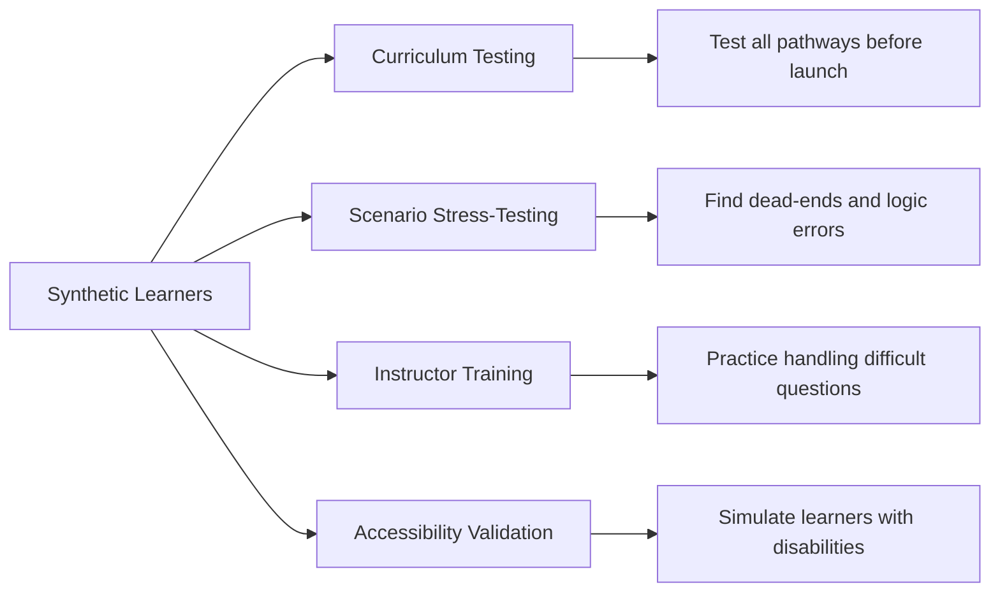

# The Future of AI-Powered Instructional Design

In **[Chapter 5](05-advanced-ai.md)**, we explored the technical architecture of high-fidelity AI systems. We are at the precipice of the "Third Wave" of AI in education. If the first wave was basic automation and the second wave was generative assistance, the third wave (2025–2030) will be defined by **autonomous orchestration** and **hyper-personalization**.

We are at the precipice of the "Third Wave" of AI in education. If the first wave was basic automation and the second wave was generative assistance, the third wave (2025–2030) will be defined by **autonomous orchestration** and **hyper-personalization**.

## 1. Hyper-Personalization: The "Curriculum of One"

By 2030, the concept of a "static course" will likely be obsolete. Instead of all learners moving through the same 10 modules, AI will generate a unique learning path for every individual in real-time (EDUCAUSE, 2025).

- **Biometric Feedback**: AI will use non-invasive biometric data (eye-tracking, heart rate, and emotional sentiment) to detect when a learner is frustrated or bored and adjust the difficulty or content format instantly.
- **Micro-Pivot Learning**: If a learner fails a quiz on "Python Lists," the AI doesn't just show the correct answer; it instantly generates a new lesson on that topic using a different teaching style (e.g., switching from text to an interactive simulation).
- **Affective Learning Systems**: Moving beyond just difficulty, AI will adjust its *pedagogical persona*. If the system detects a learner's confidence is low, it may shift to a more supportive, scaffolding-heavy tone; if the learner is high-performing but bored, it may shift to a more Socratic, challenging persona.

## 2. Synthetic Learners and Digital Twins

One of the most transformative applications of AI in instructional design will be **Synthetic Learners**—AI personas that simulate real students with specific characteristics, knowledge gaps, and learning behaviors.

### Use Cases for Synthetic Learners

- **Curriculum Stress-Testing**: Before launching a course to 10,000 employees, run 1,000 synthetic learners through it. Each synthetic learner makes different mistakes, asks different questions, and follows different paths—exposing any "dead ends" or confusing content.
- **Instructor Preparation**: Trainers can practice with AI-simulated learners who exhibit challenging behaviors (e.g., resistant to change, asking unusually complex questions) before facing real participants.
- **Digital Twins for Personalization**: Imagine a "digital twin" of each employee that tracks their learning history, skill progression, and preferences. AI uses this twin to predict what content will resonate and what approach will be most effective.

> [!TIP]
> **Near-Term Application**: Even in 2025, you can create simple synthetic learner personas using ChatGPT or Claude. Ask the AI to "role-play as a skeptical middle manager with 20 years of experience who doesn't see the value in this training" and use it to stress-test your content.

## 3. Multimodal Learning Landscapes

The future of learning will be **multimodal**—seamlessly blending text, video, audio, AR/VR, and real-time interaction within a single learning experience.

### The Multimodal Stack

| Modality | 2025 State | 2030 Projection |
|----------|------------|-----------------|
| **Text** | AI-generated drafts, human-edited | Fully personalized, generated on-demand |
| **Video** | AI avatars (Synthesia, HeyGen) | Photorealistic avatars indistinguishable from humans |
| **Audio** | High-quality TTS (ElevenLabs) | Real-time voice cloning with emotional nuance |
| **AR/VR** | Specialized hardware, limited adoption | Lightweight glasses, mainstream adoption |
| **Simulation** | Pre-built scenarios | AI-generated dynamic scenarios in real-time |

### The Unified Learning Interface

By 2030, learners won't think about "modalities"—they'll simply ask a question and receive the answer in whatever format is most effective:

- *"Show me how to do this"* → AI generates a video demonstration on the fly
- *"Walk me through this"* → AR overlay appears on their actual equipment
- *"Explain why this works"* → Interactive 3D model with voice explanation
- *"Practice this with me"* → AI-driven simulation with real-time feedback

> [!NOTE]
> **The ID's Role in Multimodal Design**: You won't be creating each modality separately. Instead, you'll design the **content architecture** and **modality rules**—specifying when video is appropriate vs. text vs. simulation, and letting AI generate the actual content on demand.

## 4. The Sovereign Learner: The End of the LMS?

In 2025, we are seeing the rise of the **Sovereign Learner**. Instead of an ID building a course for an LMS, the learner’s own **Personal AI Agent** will "crawl" through the organization’s RAG-powered knowledge base.
*   The learner says: "I need to learn how to process a refund in our new system."
*   Their Personal AI interacts with the company’s "Knowledge Shell," synthesizes the relevant policy, and creates a 5-minute custom tutorial on the fly.
*   **The ID's Role**: You no longer build the *tutorial*; you build the **Knowledge Shell** and the **Rules of Engagement** that the Personal AI must follow.

## 5. The Shift in K-12 and Labor Market Skills

Innovation isn't just about tools; it's about preparing learners for a rapidly changing labor market. As highlighted by Miao & Mishra (2025), the focus of EdTech innovation is shifting from simple content delivery to fostering **"Future-Ready Skills."**

- **Cognitive Flexibility**: AI can answer static questions. The new curriculum prioritizes the ability to switch between concepts and adapt to new AI tools.
- **Strategic GenAI Innovation**: Rather than just "using AI in class," institutions must adopt a long-term strategy where GenAI is integrated into the assessment of learning itself, moving away from rote memorization toward measuring critical thinking and problem-solving in real-world scenarios.

## 6. The Evolving Role: From Designer to Architect

The most significant change will not be in the technology, but in the **human role**. The instructional designer of 2030 will be a "Learning Architect" or "Experience Orchestrator."

- **The Architect**: Focuses on the high-level strategy, ethics, and "human-in-the-loop" verification.
- **The Systems Integrator**: The future ID must understand how to "plug" different AI models together. You will be responsible for ensuring the text-generation model talks correctly to the video-generation model and that the results are tracked accurately via xAPI.
- **The Orchestrator**: Manages a fleet of AI agents (Content Agents, Assessment Agents, Feedback Agents) to build learning experiences at a scale and speed previously unimaginable (Articulate, 2025).

## 7. The Ethical Frontier: Attention vs. Learning

As AI becomes more effective at capturing attention, IDs must face a new ethical challenge: **"Neuromarketing" in Education**.
*   **The Risk**: Using AI to keep learners "hooked" through gamification and dopamine loops, even if no real learning is occurring.
*   **The Responsibility**: The ID must ensure that AI serves the learner’s **Cognitive Growth**, not just their **Engagement Metrics**. We must be the guardians of "Deep Work" in an age of automated distraction.

## 8. Conclusion: Staying AI-Fluent

The future of instructional design is bright, but it requires a fundamental shift in mindset. We must move away from guarding our "creative output" and toward mastering our "orchestration input." 

As we conclude this ebook, remember that AI is a tool of empowerment. It automates the routine so that we can focus on the core of our profession: **human empathy, pedagogical soundness, and the joy of learning.**

---

### Final Reflection
What is one skill you use today that you think an AI will do better in 2030? What is one skill you use today that an AI will *never* be able to replicate?

---
*References:*

- Articulate (2025). *How AI is Transforming Instructional Design*.
- EDUCAUSE (2025). *2025 Horizon Report | Teaching and Learning Edition*.
- Gartner (2025). *Hype Cycle for Artificial Intelligence, 2025*.
- Miao, X. & Mishra, P. K. (2025). *Preparing Future-Ready Learners: K12 Skills Shift and GenAI EdTech Innovation Direction*.

### What’s Next?
Understanding the future vision is critical, but implementing it requires more than technical skill—it requires leadership. In our final chapter, **[Chapter 7: Leading the AI Transformation](07-leading-ai-transformation.md)**, we will discuss how to move from an individual contributor to a strategic leader in your organization.
