# Leading the AI Transformation

The previous chapters gave you the technical skills and future vision of AI-powered instructional design. From understanding LLMs in **[Chapter 1](01-ai-fundamentals.md)** to exploring RAG and Agents in **[Chapter 5](05-advanced-ai.md)**, you now have the toolkit of a **Learning Architect**.

This chapter gives you the *strategy* to lead the transformation. As an Instructional Designer in 2025, you are not just a content creator—you are a **change agent**.

!!! tip "Leadership Starts With You"
    You don't need a leadership title to lead AI adoption. You need a clear vision, demonstrated results, and the ability to bring others along.

---

## 1. Building the Business Case: Beyond "Faster"

When pitching AI adoption to leadership, the default argument is "speed." While AI *does* reduce development time, **that's a dangerous metric on its own**—it implies that L&D is a cost center to be minimized.

### Reframe from Cost to Value

```mermaid
flowchart LR
    subgraph Wrong ["❌ Cost Framing"]
        A1[AI saves time] --> A2[We need fewer IDs]
        A2 --> A3[L&D is a cost center]
    end
    
    subgraph Right ["✅ Value Framing"]
        B1[AI multiplies capacity] --> B2[We can do MORE]
        B2 --> B3[L&D is a strategic partner]
    end
```



### The Three Pillars of Value

| Pillar | Executive Language | Example |
|--------|-------------------|---------|
| **Speed-to-Competency** | "Revenue enablement" | "AI allows us to update sales training in 2 hours vs. 2 weeks. Our sales team sells the new product 10 days sooner—that's $X in accelerated revenue." |
| **Scale of Personalization** | "Democratized access" | "We currently offer coaching to the top 10% of leaders. With AI agents, we offer personalized coaching to 100% of the workforce." |
| **Risk Mitigation** | "Compliance assurance" | "RAG-based compliance bots provide 24/7 accurate policy answers, reducing legal liability compared to static PDFs nobody reads." |

### ROI Calculation Template

Use this framework to build your business case:

| Metric | Before AI | After AI (Projected) | Delta |
|--------|-----------|---------------------|-------|
| **Development time per module** | 80 hours | 40 hours | -50% |
| **Modules produced per quarter** | 4 | 8 | +100% |
| **Time to respond to business changes** | 2 weeks | 2 days | -85% |
| **Personalized training coverage** | 10% | 100% | +900% |
| **SME time per module** | 20 hours | 8 hours | -60% |

### Sample Business Case Prompt

```
You are a strategic L&D consultant. Help me build a business case for AI adoption.

Context:
- Organization: [SIZE, INDUSTRY]
- Current L&D challenge: [SPECIFIC PAIN POINT]
- Executive audience: [CLO/HR Director/CFO]
- Budget constraints: [LEVEL]

Create:
1. Executive Summary (3 sentences)
2. Problem Statement with cost of status quo
3. Proposed Solution with AI-powered approach
4. Projected ROI with realistic metrics
5. Risk mitigation for common objections
6. Recommended pilot scope
```

---

## 2. Upskilling the L&D Team

The shift to AI requires fundamental reskilling. The traditional ID skills aren't obsolete—they're evolving.

### The Skills Transformation Matrix

```mermaid
flowchart LR
    subgraph Old Skills
        A1[📝 Copywriting]
        A2[🎨 Graphic Design]
        A3[👥 SME Interviewing]
        A4[✅ QA: Typos]
    end
    
    subgraph New Skills
        B1[🤖 Prompt Engineering & Editing]
        B2[🎨 AI Art Direction & Curation]
        B3[🧠 Knowledge Engineering for RAG]
        B4[🔍 QA: Bias, Hallucination, Pedagogy]
    end
    
    A1 --> B1
    A2 --> B2
    A3 --> B3
    A4 --> B4
```



| Old Skill | New Skill | Training Path |
|-----------|-----------|---------------|
| **Copywriting** | Prompt Engineering & Editing | Prompt frameworks + output refinement |
| **Graphic Design** | Visual AI Curation | Style guide creation + AI tool mastery |
| **SME Interviewing** | Knowledge Engineering | Document structuring for RAG systems |
| **Typo Checking** | Bias & Hallucination Detection | Critical evaluation frameworks |
| **LMS Administration** | AI Workflow Orchestration | Agent design + automation |

### The AI Champions Model

Don't force the entire team to transform at once. Use a phased approach:


### 90-Day Upskilling Plan

| Week | Focus | Activities |
|------|-------|------------|
| **1-2** | Awareness | AI demo sessions, fear-addressing conversations |
| **3-4** | Fundamentals | Prompt engineering basics, tool exploration |
| **5-6** | Application | First AI-assisted project, paired work |
| **7-8** | Reflection | What worked? What didn't? Process refinement |
| **9-10** | Expansion | New tools, advanced techniques |
| **11-12** | Sharing | Champions teach others, document playbooks |

---

## 3. Overcoming Resistance and Fear

"Will AI replace me?" This is the silent question in every team meeting. As a leader, address this **directly and honestly**.

### The Replacement Myth vs. Reality


### Addressing Common Fears

| Fear | Honest Response | Evidence |
|------|-----------------|----------|
| "AI will take my job" | AI replaces tasks, not people. Your role is evolving, not disappearing. | Companies using AI are expanding L&D, not shrinking it. |
| "I'm too old/new to learn this" | AI tools are becoming easier. If you can write an email, you can write a prompt. | 60+ year old IDs successfully adopting AI in major orgs. |
| "AI output is garbage" | It is—without good prompts and review. That's where your expertise matters. | Quality of output correlates with quality of input and curation. |
| "This is just hype" | The technology is real. The question is how we use it ethically and effectively. | Major organizations achieving measurable results (see Chapter 4). |

### The Human-in-the-Loop Guarantee

Establish a clear policy that reinforces human value:

!!! info "Sample Policy Statement"
    "All AI-generated content must pass through human review before deployment. AI accelerates production; human judgment ensures quality, accuracy, and ethical standards. No exceptions."

This policy:
- Reassures team members their expertise matters
- Protects the organization from AI errors
- Creates natural checkpoints for quality

---

## 4. Governance: The Guardrails of Innovation

Innovation without governance leads to chaos (and lawsuits). Partner with Legal and IT to create clear boundaries.

### The L&D AI Acceptable Use Policy

Every organization needs documented guardrails:


### Key Policy Pillars

| Pillar | Policy Element | Example Language |
|--------|---------------|------------------|
| **Data Privacy** | What data CAN'T be used | "We never input employee PII into public AI models." |
| **IP Ownership** | Who owns the output | "We verify terms of service to ensure WE own all generated content." |
| **Transparency** | When to disclose AI use | "AI-generated avatars are labeled as such in learner-facing content." |
| **Approval Workflow** | Who signs off | "Compliance training requires Legal review before deployment." |
| **Tool Vetting** | How new tools are approved | "New AI tools require IT security review before L&D use." |

### Governance Checklist for New AI Tools

Before adopting any new AI tool:

- [ ] Security review completed by IT
- [ ] Terms of service reviewed by Legal
- [ ] Data processing agreement (DPA) signed
- [ ] Output ownership confirmed in writing
- [ ] Export options verified (avoid lock-in)
- [ ] Training materials available for team
- [ ] Success metrics defined
- [ ] Review date scheduled (6 months)

---

## 5. Change Management: The Human Side

Technical implementation is the easy part. Culture change is hard.

### The ADKAR Model for AI Adoption

Apply change management frameworks to AI transformation:

```mermaid
flowchart LR
    A[🔔 Awareness<br>Why change?] --> B[💪 Desire<br>Want to change]
    B --> C[📚 Knowledge<br>How to change]
    C --> D[⚡ Ability<br>Can change]
    D --> E[🔄 Reinforcement<br>Sustain change]
```



| Stage | Key Actions | Common Blockers |
|-------|-------------|-----------------|
| **Awareness** | Demo AI capabilities, share industry trends | "This is just hype" |
| **Desire** | Show what's in it for them, address fears | "I don't want to learn something new" |
| **Knowledge** | Training, documentation, playbooks | "I don't know how" |
| **Ability** | Hands-on practice, paired work, coaching | "I can't do it under real conditions" |
| **Reinforcement** | Celebrate wins, measure progress, iterate | "Old habits are easier" |

### Communication Strategy

| Audience | Message Frame | Channel |
|----------|---------------|---------|
| **Leadership** | ROI, competitive advantage, risk mitigation | Executive briefings, business cases |
| **L&D Team** | Career evolution, new skills, less tedium | Team meetings, 1:1s, workshops |
| **SMEs** | More time for expertise, less for reviewing drafts | Pilot invitations, demo sessions |
| **Stakeholders** | Faster turnaround, better quality | Project kickoffs, progress updates |

---

## 6. Measuring Success: KPIs for AI Transformation

You can't manage what you don't measure. Define clear metrics from day one.

### Balanced Scorecard for AI-Powered L&D

| Category | Metric | Target |
|----------|--------|--------|
| **Efficiency** | Development time per module | -50% by month 6 |
| **Capacity** | Modules produced per quarter | +100% by month 6 |
| **Quality** | SME revision requests | -30% |
| **Satisfaction** | Team confidence with AI tools | >4/5 rating |
| **Impact** | Learner engagement scores | Maintain or improve |
| **Innovation** | New formats/approaches tried | 3+ new innovations |

### Tracking Progress


---

## 7. From ID to Strategic Partner

The ultimate goal: elevating L&D from "order taker" to "strategic business partner."

### The Evolution


### Strategic Partner Behaviors

| Order Taker | Strategic Partner |
|-------------|-------------------|
| Waits for requests | Proactively identifies learning needs |
| Accepts scope as given | Challenges assumptions, recommends alternatives |
| Measures completion | Measures business impact |
| Reports activity | Demonstrates ROI |
| Reacts to problems | Anticipates future skill needs |

---

## Reflection Exercise: The Pitch Deck

**Goal**: Prepare for a real leadership conversation.

### Step 1: Identify Your Audience
Who is the key decision-maker you need to influence?
- CLO? HR Director? CFO? CTO?

### Step 2: Select Their Pain Point
What problem do they care about most?
- Speed to market? Cost reduction? Quality issues? Compliance risks?

### Step 3: Draft Your 3-Slide Pitch

| Slide | Content | Notes |
|-------|---------|-------|
| **Slide 1: The Problem** | Current pain point + cost of status quo | Use numbers if possible |
| **Slide 2: The Solution** | AI-augmented approach + expected outcomes | Connect to their priorities |
| **Slide 3: The Ask** | Pilot scope, budget, timeline | Start small, prove value |

### Step 4: Anticipate Objections

| Objection | Your Response |
|-----------|---------------|
| "It's too expensive" | [Your response] |
| "Our team isn't ready" | [Your response] |
| "What about quality?" | [Your response] |
| "Security concerns" | [Your response] |

---

## Action Items: Your 30-Day Leadership Plan

| Week | Action | Deliverable |
|------|--------|-------------|
| **Week 1** | Audit current AI usage (formal or informal) | Assessment report |
| **Week 2** | Identify 2-3 quick wins for AI adoption | Prioritized opportunity list |
| **Week 3** | Draft governance proposal | 1-page policy draft |
| **Week 4** | Build business case for first pilot | Pitch deck + ROI projection |

---

*References:*

- McKinsey & Company (2023). *The Economic Potential of Generative AI*.
- SHRM (2025). *From Adoption to Empowerment: Shaping the AI-Driven Workforce of Tomorrow*.
- Prosci. *ADKAR Model for Change Management*.

---

### What's Next?

You now have the foundation to lead AI transformation in your organization. For specialized applications in workforce development, continue to **[Chapter 8: AI for Adult Learning & Workforce Development](08-workforce-development.md)**.
