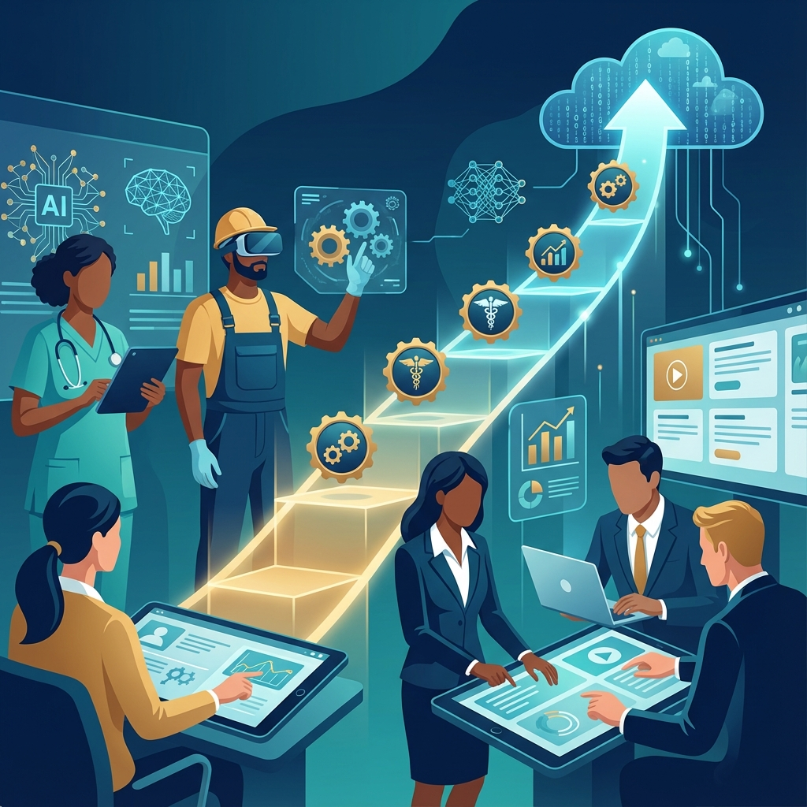
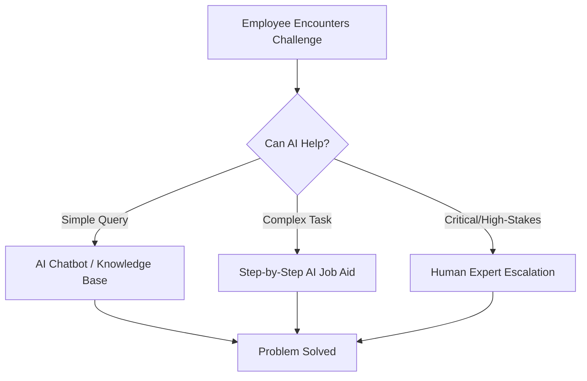
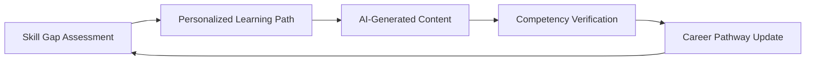
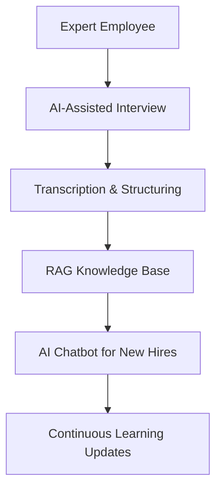

# AI for Adult Learning & Workforce Development

The previous chapters have established the foundations of AI-powered instructional design. In this chapter, we focus on the unique context of **workforce development**—training adult learners who bring experience, motivation, and real-world constraints to the learning environment. Understanding how AI intersects with adult learning principles is essential for any instructional designer working in corporate training, government, skilled trades, or continuing education.

## 1. Andragogy Meets AI: Principles of Adult Learning

Malcolm Knowles' theory of **Andragogy** (adult learning) identifies six key principles that differentiate adult learners from children. Each principle has profound implications for how we design AI-powered learning experiences.

### The Six Principles and AI Applications

| Principle | Description | AI Application |
|-----------|-------------|----------------|
| **Self-Concept** | Adults are self-directed and autonomous | AI-powered personalized learning paths that respect learner choice and agency |
| **Experience** | Adults bring prior knowledge and want it valued | RAG systems that connect new content to the learner's existing job context |
| **Readiness to Learn** | Adults learn when they need to apply knowledge | Just-in-time performance support powered by AI chatbots |
| **Problem-Centered** | Adults prefer learning tied to real problems | AI-generated scenario-based training using real workplace challenges |
| **Internal Motivation** | Adults are motivated by relevance and mastery | AI progress tracking with meaningful competency-based milestones |
| **Need to Know** | Adults want to understand "why" before learning | AI explanations that contextualize learning within job outcomes |

> [!TIP]
> **Design Principle**: Every AI-generated learning experience should answer the adult learner's first question: *"Why do I need to know this, and how will it help me do my job better?"*

### The Experience Multiplier

Unlike K-12 learners, adults enter training with decades of accumulated experience. AI can leverage this by:

- **Skill Gap Analysis**: Using AI to assess what the learner already knows and skipping redundant content
- **Experience Integration**: Prompting AI to generate scenarios that reference the learner's industry or job role
- **Reverse Mentoring**: Using AI to help capture and disseminate the tacit knowledge of experienced workers

## 2. Just-in-Time Learning: AI-Powered Performance Support

In workforce development, the most valuable learning often happens **at the moment of need**—when an employee is stuck on a task and needs immediate guidance.

### The Performance Support Hierarchy

### Types of AI-Powered Performance Support

1. **Electronic Performance Support Systems (EPSS)**
   - AI-embedded within software applications (e.g., Salesforce Einstein, Microsoft Copilot)
   - Provides contextual help without leaving the workflow

2. **Conversational AI Job Aids**
   - Chatbots trained on SOPs, manuals, and best practices
   - Employees ask questions in natural language and receive precise answers

3. **Augmented Reality (AR) Overlays**
   - AI-driven visual guides for equipment maintenance, assembly, or repair
   - Especially powerful in manufacturing and skilled trades

> [!NOTE]
> **The 5 Moments of Need**: Bob Mosher and Conrad Gottfredson's framework identifies when learners need support: Learning **New**, Learning **More**, **Applying**, **Solving**, and **Changing**. AI excels at the "Applying" and "Solving" moments where speed is critical.

## 3. Upskilling & Reskilling at Scale

The modern workforce faces unprecedented disruption. The World Economic Forum estimates that 50% of all employees will need reskilling by 2025. AI is the only way to deliver personalized upskilling at the scale organizations require.

### The AI-Powered Upskilling Pipeline

### Key Components

#### 1. Skill Gap Analysis with AI

- **Input**: Job descriptions, competency frameworks (like O*NET), and employee performance data
- **AI Process**: Natural language comparison of current skills vs. required skills
- **Output**: Prioritized skill gaps with recommended learning resources

#### 2. Personalized Learning Paths

- AI generates a unique curriculum for each employee based on:
  - Current role and target role
  - Existing skills and knowledge
  - Learning style preferences
  - Time available for training

#### 3. Competency-Based Progression

- AI-powered assessments that measure **what the learner can do**, not just what they know
- Automatic advancement when competency is demonstrated
- Micro-credentials and digital badges issued upon mastery

### Real-World Application: The Skills Taxonomy

For AI to power upskilling effectively, organizations need a **Skills Taxonomy**—a structured vocabulary of skills and competencies.

| Level | Example |
|-------|---------|
| **Skill Domain** | Technology |
| **Skill Category** | Data Analysis |
| **Specific Skill** | SQL Query Writing |
| **Proficiency Level** | Intermediate (Can write complex joins and subqueries) |

> [!IMPORTANT]
> **Without a taxonomy, AI cannot make intelligent recommendations.** The ID's role in workforce development often starts with building or refining this foundational structure.

## 4. Compliance & Regulatory Training: AI for High-Stakes Learning

Workforce development often involves mandatory compliance training where accuracy is non-negotiable. AI must be implemented with extreme care in these contexts.

### Common Compliance Training Domains

| Domain | Examples | AI Opportunities |
|--------|----------|------------------|
| **Workplace Safety** | OSHA, HAZMAT, PPE | AI-generated scenario simulations, VR safety walkthroughs |
| **Healthcare** | HIPAA, OSHA Bloodborne Pathogens | RAG systems grounded in specific regulations |
| **Financial Services** | AML, BSA, SOX, FINRA | Personalized training based on employee role and risk level |
| **Data Privacy** | GDPR, CCPA, State Privacy Laws | Just-in-time guidance on data handling |
| **Ethics & Conduct** | Code of Conduct, Anti-Harassment | Scenario branching with AI-powered dialogue |

### The Compliance Training Workflow with AI

1. **Regulatory Monitoring**: AI scans regulatory updates and flags changes that require training updates
2. **Content Generation**: AI drafts updated training content, grounded in the new regulations (RAG)
3. **Scenario Design**: AI creates realistic workplace scenarios that test application of the rules
4. **Assessment & Certification**: AI-powered assessments with audit trails for compliance reporting
5. **Continuous Reinforcement**: AI sends micro-learning reminders to reinforce key concepts

> [!WARNING]
> **Legal Review Required**: AI-generated compliance content must ALWAYS be reviewed by legal counsel or compliance officers before deployment. The cost of an AI hallucination in this domain is regulatory fines and organizational liability.

### Case Study: AI for OSHA Safety Training

A manufacturing company implemented an AI-powered safety training system:

- **Challenge**: 5,000 employees across 12 facilities, each with different equipment and hazards
- **Solution**: A RAG system connected to each facility's safety manual, generating localized training scenarios
- **Result**: 40% reduction in recordable safety incidents; training time reduced by 30%

## 5. Knowledge Transfer: Capturing Expertise Before It Leaves

One of the biggest challenges in workforce development is **knowledge loss** when experienced employees retire or leave. AI provides new tools for capturing and transferring tacit knowledge.

### The Knowledge Transfer Pipeline

### AI Techniques for Knowledge Transfer

1. **AI-Assisted Interviews**
   - Use AI to generate smart interview questions based on the expert's job role
   - Transcribe and summarize hours of tacit knowledge into structured documents

2. **Video Analysis**
   - Record experts performing complex tasks
   - AI generates step-by-step guides from the video with annotations

3. **Synthetic Experts**
   - Create an AI persona trained on the retired expert's documented knowledge
   - New hires can "ask" the synthetic expert questions

> [!TIP]
> **Start Early**: Don't wait until an expert announces retirement. Build knowledge capture into ongoing performance management with regular AI-assisted "knowledge audits."

## 6. The 70-20-10 Model Reimagined with AI

The 70-20-10 framework suggests that learning happens through:

- **70%** Experiential (on-the-job)
- **20%** Social (coaching, mentoring)
- **10%** Formal (courses, training)

AI is transforming all three components:

| Component | Traditional Approach | AI-Enhanced Approach |
|-----------|---------------------|---------------------|
| **70% Experiential** | Trial and error on the job | AI-powered simulations, AI job aids during work |
| **20% Social** | Finding a mentor, peer learning | AI-matched mentors, AI-facilitated cohort learning |
| **10% Formal** | Scheduled classroom training | On-demand AI-generated courses, personalized paths |

### AI-Matched Mentoring

AI can analyze skill profiles, career goals, and personality assessments to match mentees with ideal mentors within an organization—dramatically improving the effectiveness of the 20%.

## 7. Measuring Success: ROI of AI-Powered Workforce Training

For workforce development, demonstrating **Return on Investment (ROI)** is critical. AI not only improves training outcomes but also provides better data to prove it.

### The Kirkpatrick + Phillips Model with AI

| Level | Metric | AI Enhancement |
|-------|--------|----------------|
| **1. Reaction** | Learner satisfaction | AI sentiment analysis of feedback |
| **2. Learning** | Knowledge/skill acquisition | AI-powered adaptive assessments |
| **3. Behavior** | On-the-job application | AI tracking via performance support usage |
| **4. Results** | Business impact | AI correlation of training data with KPIs |
| **5. ROI** | Financial return | AI predictive modeling of training value |

### Key Metrics for Workforce AI

- **Time-to-Competency**: How quickly new hires reach full productivity
- **Training Efficiency Ratio**: Learning outcomes per hour invested
- **Skill Gap Closure Rate**: Speed at which identified gaps are resolved
- **Performance Support Utilization**: How often AI job aids are accessed (high = effective)
- **Retention Impact**: Correlation between training completion and employee retention

---

## Reflection Exercise: Designing for Adult Learners

**Goal**: Apply andragogy principles to an AI-enhanced workforce training design.

1. **Scenario**: You are designing onboarding training for a manufacturing company's new safety protocols.
2. **Analysis**: For each of the six andragogy principles, describe how you would design the AI-powered experience to honor that principle.
3. **Prompt Engineering**: Write a prompt that instructs an AI to generate a safety scenario that respects the adult learner's prior experience in the field.

**Example Prompt**:
> "You are a training content developer for manufacturing safety. Generate a realistic safety scenario for experienced machine operators (5+ years) that tests application of lockout/tagout procedures. The scenario should acknowledge their expertise while introducing a new edge case they may not have encountered. Include decision points and consequences."

---

*References:*

- Gottfredson, C. & Mosher, B. (2011). *Innovative Performance Support*. McGraw-Hill.
- Knowles, M. S. (1984). *Andragogy in Action*. Jossey-Bass.
- World Economic Forum (2020). *The Future of Jobs Report 2020*.
- Phillips, J. J. (2003). *Return on Investment in Training and Performance Improvement Programs*. Butterworth-Heinemann.

### What's Next?

Now that we've explored the unique needs of workforce development, the next step is to build your practical toolkit. In **[Appendix B: Workforce Development Prompts & Templates](../appendix-workforce.md)**, you'll find ready-to-use resources for common workforce training challenges.
