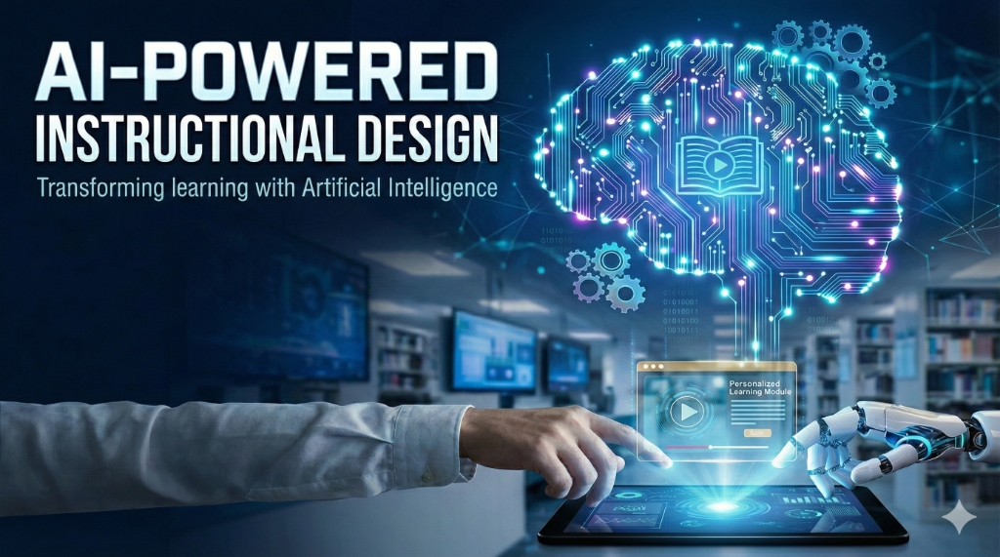

# AI-Powered Instructional Design

Welcome to the open-source ebook on **AI-Powered Instructional Design**.

This book explores how artificial intelligence can be integrated into the instructional design process to create more effective, efficient, and personalized learning experiences—with a special focus on **adult learners in workforce development**.

## Chapters

### Foundations

- [**Chapter 0: Introduction**](chapters/00-introduction.md) - Overview of the book and its philosophy.
- [**Chapter 1: AI Fundamentals**](chapters/01-ai-fundamentals.md) - Understanding the basics of AI for IDs.
- [**Chapter 2: Prompt Engineering**](chapters/02-prompt-engineering.md) - Mastering the art of communicating with AI.
- [**Chapter 3: The ID-AI Workflow (ADDIE)**](chapters/03-id-ai-workflow.md) - Reimagining the ADDIE model with AI.

### Application & Case Studies

- [**Chapter 4: Case Studies**](chapters/04-case-studies.md) - Real-world examples of AI in action.
- [**Chapter 5: Advanced AI Implementation**](chapters/05-advanced-ai.md) - Going beyond the basics with RAG and Agents.

### Future & Leadership

- [**Chapter 6: The Future of AI-Powered ID**](chapters/06-the-future.md) - Emerging trends and future predictions.
- [**Chapter 7: Leading the AI Transformation**](chapters/07-leading-ai-transformation.md) - Becoming an AI leader in your organization.

### Workforce Development

- [**Chapter 8: AI for Adult Learning & Workforce Development**](chapters/08-workforce-development.md) - Andragogy, upskilling, and performance support.
- [**Chapter 9: Workforce Case Studies**](chapters/09-workforce-case-studies.md) - Industry-specific implementations.

## Appendices & Resources

- [**Appendix A: ID Playbook**](appendix.md) - Quick reference guide for AI-powered ID.
- [**Appendix B: Workforce Prompts & Templates**](appendix-workforce.md) - Ready-to-use prompts for workforce training.
- [**Bibliography**](bibliography.md) - Complete list of references and resources.
- [**Glossary**](glossary.md) - Key terms and definitions.

## License

This work is licensed under the [MIT License](https://opensource.org/licenses/MIT) - free to use, modify, and distribute for any purpose.

---

## Support This Project

If you find this ebook helpful, consider supporting its continued development:

