# Quick Start Guide

> **For busy L&D professionals who need results now.**

Don't have time to read the full ebook? This guide distills the essential concepts and gives you actionable tools you can use **today**.

---

## ⏱️ Your AI Journey in 15 Minutes

```mermaid
flowchart LR
    A[5 min<br>Core Concepts] --> B[5 min<br>First Prompt]
    B --> C[5 min<br>Integrate Workflow]
    C --> D[🚀 You're AI-Enabled!]
```



---

## Part 1: Core Concepts (5 minutes)

### What You Need to Know

!!! info "The Bottom Line"
    AI is your **creative partner**, not your replacement. It handles the routine so you can focus on strategy, quality, and the human elements of learning.

### Key Terms (30 seconds each)

| Term | What It Means for You |
|------|----------------------|
| **LLM** | Large Language Model—the "brain" behind ChatGPT, Claude, Gemini |
| **Prompt** | Your instruction to the AI—the better the prompt, the better the output |
| **Hallucination** | When AI makes things up—why you must always verify output |
| **RAG** | Retrieval-Augmented Generation—connecting AI to your specific content |
| **Token** | How AI measures text—affects costs and context limits |

### The 3 Golden Rules

1. **🧠 AI = First Draft, Never Final**  
   Always review, edit, and verify AI output before use.

2. **📝 Garbage In = Garbage Out**  
   The quality of your prompt determines the quality of output.

3. **🔒 Never Share Sensitive Data**  
   Assume anything you type could be used for training (unless using enterprise tools).

---

## Part 2: Your First AI Prompt (5 minutes)

### The RACE Framework

Use this structure for consistently better results:

```
R - Role: Who should the AI be?
A - Action: What should it do?
C - Context: What's the situation?
E - Execution: How should it deliver?
```

### Try It Now: Learning Objective Generator

Copy this prompt into ChatGPT, Claude, or your preferred AI:

```
ROLE: You are an expert instructional designer with 15 years of experience 
creating corporate training for adult learners.

ACTION: Create 3 measurable learning objectives for a training module.

CONTEXT:
- Topic: [INSERT YOUR TOPIC HERE]
- Audience: [INSERT YOUR AUDIENCE]
- Duration: [INSERT DURATION]
- Desired outcomes: Learners should be able to [INSERT OUTCOMES]

EXECUTION:
- Use Bloom's Taxonomy action verbs
- Make each objective measurable
- Format as: "By the end of this module, learners will be able to [verb] + [object] + [condition/criteria]"
- Include the Bloom's level in parentheses after each objective
```

!!! tip "Pro Tip"
    Save this prompt as a template. Replace the bracketed text for each new project.

---

## Part 3: Integrate Into Your Workflow (5 minutes)

### ADDIE + AI: The Quick Reference

| Phase | Use AI For | Don't Use AI For |
|-------|-----------|------------------|
| **Analyze** | Summarizing needs assessment data, generating interview questions | Making strategic decisions about scope |
| **Design** | Drafting objectives, outlining modules, suggesting activities | Final approval on learning strategy |
| **Develop** | Writing content, creating scenarios, generating quizzes | Quality assurance and accuracy verification |
| **Implement** | Creating job aids, communication templates, FAQ responses | Stakeholder relationship management |
| **Evaluate** | Analyzing feedback, summarizing survey data, drafting reports | Interpreting data and making recommendations |

### 5 Quick Wins to Start Today

1. **Turn meeting notes into action items**  
   Paste your messy notes → Get organized next steps

2. **Generate quiz questions from content**  
   Paste your module content → Get 10 assessment questions

3. **Create scenario variations**  
   Describe one scenario → Get 5 variations for different learner levels

4. **Summarize long documents**  
   Paste that 50-page policy → Get a 1-page summary for training

5. **Draft learner communications**  
   Describe the situation → Get email templates for pre-training, reminders, follow-up

---

## 🎯 Ready-to-Use Prompt Templates

### Template 1: Scenario-Based Learning

```
Create a realistic workplace scenario for:
- Topic: [TOPIC]
- Industry: [INDUSTRY]
- Role: [LEARNER'S JOB ROLE]

The scenario should:
- Present a challenging but realistic situation
- Require the learner to apply [SPECIFIC SKILL/KNOWLEDGE]
- Have 3 decision points with consequences
- Include realistic dialogue

Format: Narrative with embedded decision points marked as [DECISION 1], [DECISION 2], [DECISION 3]
```

### Template 2: Knowledge Check Questions

```
Generate 5 assessment questions for the following content:

[PASTE YOUR CONTENT HERE]

Requirements:
- 2 multiple choice (4 options each)
- 2 scenario-based questions
- 1 true/false with explanation required
- All questions should assess application, not just recall
- Include correct answers and brief explanations
```

### Template 3: Quick Job Aid

```
Create a one-page job aid (quick reference guide) for:
- Task: [TASK NAME]
- Audience: [WHO WILL USE IT]
- When used: [WHEN/WHERE THEY'LL REFERENCE IT]

Format:
- Title
- 5-7 key steps (numbered)
- 2-3 "Common Mistakes to Avoid" callouts
- 1-2 "Pro Tips"
- Keep it scannable—use bullet points and bold key terms
```

---

## ⚠️ Common Mistakes to Avoid

!!! warning "Don't Do These"
    
    **❌ Copy-paste AI output without review**  
    AI hallucinates. Verify facts, check for bias, ensure accuracy.
    
    **❌ Use AI for strategic decisions**  
    AI is great for drafts, not for deciding if training is the right solution.
    
    **❌ Forget your audience**  
    AI writes generically unless you specify exactly who your learners are.
    
    **❌ Skip the human touch**  
    Stories, empathy, and cultural context still need a human.
    
    **❌ Ignore privacy**  
    Never paste PII, proprietary code, or confidential information.

---

## 📈 What's Next?

### Immediate (This Week)
- [ ] Try the learning objective prompt on a current project
- [ ] Generate quiz questions for an existing module
- [ ] Use AI to summarize a long document

### Short-Term (This Month)
- [ ] Read **[Chapter 2: Prompt Engineering](chapters/02-prompt-engineering.md)** for advanced techniques
- [ ] Explore **[Appendix B: Workforce Prompts](appendix-workforce.md)** for your specific needs
- [ ] Create your own prompt templates library

### Ongoing
- [ ] Read the full ebook to understand the strategic context
- [ ] Stay current with **[Appendix C: AI Tools Reference](appendix-tools.md)**
- [ ] Join L&D communities discussing AI

---

## 🔗 Deep Dives

Ready for more? Here's where to go next:

| If You Want To... | Read This |
|-------------------|-----------|
| Master prompting | [Chapter 2: Prompt Engineering](chapters/02-prompt-engineering.md) |
| Understand the tech | [Chapter 1: AI Fundamentals](chapters/01-ai-fundamentals.md) |
| See real examples | [Chapter 4: Case Studies](chapters/04-case-studies.md) |
| Lead AI adoption | [Chapter 7: Leading AI Transformation](chapters/07-leading-ai-transformation.md) |
| Focus on workforce | [Chapter 8: AI for Workforce Development](chapters/08-workforce-development.md) |
| Access prompts | [Appendix B: Workforce Prompts](appendix-workforce.md) |
| Find tools | [Appendix C: AI Tools Reference](appendix-tools.md) |

---

<div style="text-align: center; margin-top: 2rem; padding: 2rem; background: var(--md-code-bg-color); border-radius: 12px;">
    <h3>🚀 You're Ready!</h3>
    <p>You now have the essentials to start using AI in your instructional design work.</p>
    <p>Bookmark this page and come back when you need a quick reference.</p>
    <br>
    <a href="chapters/00-introduction/" class="md-button md-button--primary">
        📖 Continue to Full Ebook
    </a>
</div>
